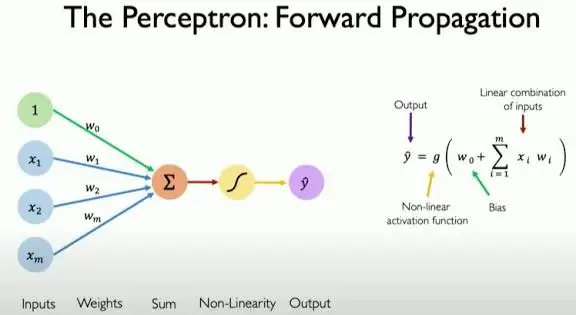
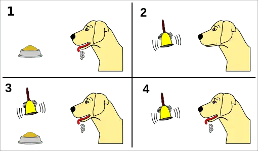

[toc]

# 问题

提问者：**<a href="https://www.zhihu.com/people/tomsheep">tomsheep</a>**
提问时间: 2025-11-2 16:58:20
总回答数: 233
总访问量: 1737155

研究领域对此有何解释？

# 回答

回答者： **<a href="https://www.zhihu.com/people/yu-you-56-63">Trisimo崔思莫</a>**
回答时间: 2025-11-2 23:7:43
点赞总数: 219
评论总数: 0
收藏总数: 136
喜欢总数：12

涌现，这个词有严重的误导性。

但实际上并没有。

模型的显性能力，更多的来自于后训练——SFT，RLHF，Self-CoT RL…

模型学会的是一种“模式识别”和“模式匹配能力”

而这种能力，从1957年单层感知机 **Perceptron** 开始就有了，你不能说单层感知机有了涌现能力。这东西年纪比你爷爷还大。

>  **它的工作方式:**   
>   
> 输入层：这不算作一层“神经元”，它只是接收输入信号的地方。比如，你要识别一张20x20像素的图片，输入层就有400个节点（每个像素一个）。  
>   
> 输出层：有且仅有1个输出神经元。这个神经元会做两件事：  
>   
> 加权求和：将所有输入信号乘以各自的权重  
> （ w ），然后加上一个偏置项（ b ）。  
>   
> 激活函数：将加权求和的结果通过一个激活函数（最初是阶跃函数），产生最终的输出（通常是0或1，代表两类分类）。

 **某种意义上说，是“特定的条件”激活了模型“特定的输出”。** 

如果条件为A，那么根据概率统计，激活成功，输出A'。与其说，这是一种智能涌现，不如说是一种基于概率的“条件反射”。传统程序也有“条件反射”， **if-then-else** ，只不过那通常是人为硬编码设置的函数区间。——而LLM的这个区间，是用大数据喂出来的。

LLM最大的不同在于Few-shot，它内部“存储”了大量的已知案例，以至于你输入 cat+中文翻译，它就会输出一个“猫”，它并不知道要输出“猫”，只是猫恰好被激活了。

所以，很多人诟病，模型其实是在搜索模式的配对，而不是在思考。

如果它们真的会思考，那么几十万、上百万个SFT问答对，就没什么用了。

ChatGPT的早期智能与“安全”，就是非洲兄弟抬出来的。

SFT和RLHF就是模型输出的骨架，底层模型做的不过是片段与词汇替换。——比如在角色扮演，温情脉脉时，你中途用一种严肃的口吻去提问，模型很快切换为模板式的回答。

为什么？因为SFT和RLHF给它焊死的“安全”和“有用”的骨架，优先级远高于你那个角色扮演的“模式”。它被“激活”了另一个更高优先级的“条件反射”。

如果LLM规模效应带来的匹配能力提升能叫“涌现”，那以前那些视觉识别模型，能从一堆像素里认出猫和狗，不也应该叫“涌现”么？

说到底，本质就是：特定模式下，特定输出的概率激活。

无非是现在的规模大了，能识别和匹配的模式多到让你产生了“智能”的错觉。

  

我们没有观察到模型出现“越级抽象”的能力，也没有“突破数据，自创理论”的能力，如果出现了这种能力，那么我们可以称之为“涌现”了。

所以，别再迷信“涌现”了。我们看到的，更多的是“规模”（Scale）和“调教”（Alignment）的力量，而不是什么神秘的智能觉醒。

  

原文地址：[(Trisimo崔思莫)为什么 LLM 仅预测下一词，就能「涌现」出高级能力？](https://www.zhihu.com/question/1968361285579150015/answer/1968454244425266314) 

