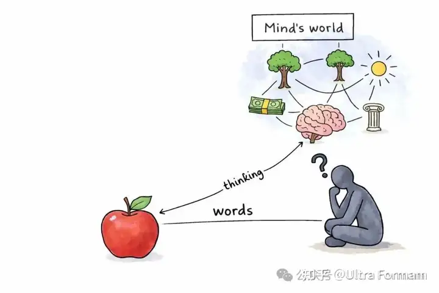
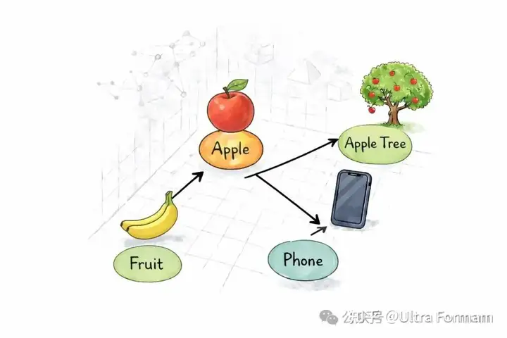
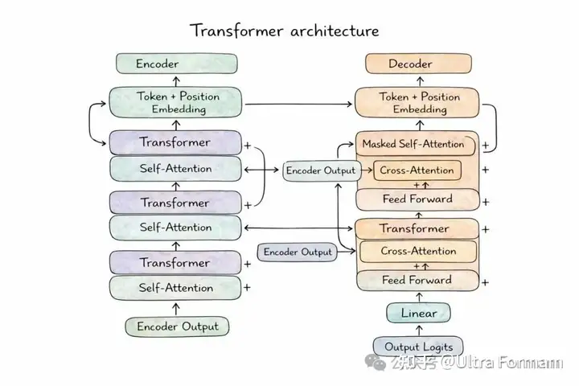
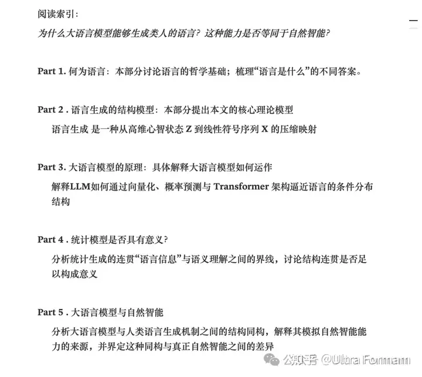

[toc]

# 问题

提问者：**<a href="https://www.zhihu.com/people/tomsheep">tomsheep</a>**
提问时间: 2025-11-2 16:58:20
总回答数: 233
总访问量: 1737159

研究领域对此有何解释？

# 回答

回答者： **<a href="https://www.zhihu.com/people/p5flgozr">Ultra Formam</a>**
回答时间: 2026-2-27 2:37:14
点赞总数: 4
评论总数: 0
收藏总数: 2
喜欢总数：0

> 本文意在讨论语言哲学、信息论与大语言模型之间的关系。以维特根斯坦为起点，从其早期关于语言的观点出发，逐步展开一个问题：为什么大语言模型能够生成类似“语言能力”的表现？这种能力在何种意义上成立，又在何种意义上仍然存疑？  
>   
> 为保证可读性，文中包含部分科普与技术性说明，整体结构略长。文末附有快速索引，诸君自取。

##  **Part 1. 何为语言？** 

在人类所有的能力之中，语言或许是最平凡却最难以定义的一种。我们每天使用它，却极少追问它的本质：语言究竟是什么？

它是世界的镜像？是规则的实践？是信息的编码？

不同答案，通向完全不同的智能观。

###  **1.1 从维特根斯坦谈起** 

二十世纪初的剑桥，年轻的维特根斯坦在其笔记中 写下了一句几乎改变语言哲学史的话：

“世界是事实的总体，而不是事物的总体。”

  

  

在他看来，命题之所以有意义，是因为它以某种结构方式“描绘”了世界的状态。语言并不是随意的声音排列，而是一种结构投影。 一个句子之所以为真，是因为它与世界的结构同构；一个句子之所以无意义，是因为它无法在世界中找到对应。在这种 **图像理论** 中，语言的任务是再现，逻辑是桥梁，而命题是模型。言因此获得了一种近乎数学的严肃性：

然而多年之后，他却改变了看法。在其晚年的著作《哲学研究》中，他写下另一句广为引用的话：

“一个词的意义，就是它在语言中的使用。”

语言不再是图像，而是行动。意义不藏在词语背后，而在我们如何用它——提问、命令、讲故事、玩笑、争论。理解一个词，并不是在心中找到一个定义，而是知道在何种情境下继续这个“游戏”。

###  **1.2 一种信号系统？** 

与此同时，另一条思想脉络在工程学领域展开。

1948年，信息论之父香农发表了《通信的数学理论》。他在开篇便声明：

信息论与语义无关。

正是这种几乎冷酷的抽象，抛开了语义对语言分析的枷锁，对于他来说，语言不再关乎意义，而关乎概率分布、编码效率与信道容量。词语成为符号，句子成为序列，沟通成为对不确定性的减少。

在这个框架下，语言的价值不在于它说了什么，而在于它如何在有限带宽中传递尽可能多的结构信息。这条路线并未试图回答“意义是什么”，却悄然改变了我们对语言的看法：

如果语言是某种信号系统，那么它必须具有冗余。它必须可以被压缩，它必须具有统计规律。

  

  

___

  

奇妙的是，这几种看法虽然彼此冲突，却共享一个事实：语言总是在限制中展开。思维是并行的、连续的、情境交织的；语言却是线性的，只能一个词接一个词地流出。我们脑海中可能同时存在犹豫、记忆与期望，但表达时只能选择其中的一部分。

语言因此必然是选择性的。它必须删减。必须依赖背景。必须利用共同知识。它不可能把全部心灵搬运出来，只能提取“足够”的部分。

也许，语言既不是单纯的镜子，也不仅仅是规则的游戏，更不是纯粹的信号。它或许是某种在限制之下的表达——一种将复杂心智状态压缩成可共享符号的方式。

如果这样想，那么语言的稳定性、它的可预测性、甚至它的可被机器学习的特征，都不再神秘。问题不再是“语言是什么？”，而是：“在这条窄窄的符号通道背后，我们究竟压缩了什么？”

  

___

##  **Part 2 语言生成的结构模型** 

###  **2.1 语言是如何生成的？** 

  

  

当一个人开口说话时，真正发生的事情并不是“词语自动出现”。在语言出现之前，往往已经存在一个模糊却复杂的内在状态：某种意图，某种判断，对情境的理解，对他人可能反应的预期。

这些状态并非线性的，而是交织的、并行的、层叠的。（解释）

然而，当语言被表达出来时，却只能一词一词地展开，这意味着，语言的生成不是简单的“读取内心”，而是某种筛选过程。我们可以将语言生成过程粗浅的看作以下程序：

1. 从复杂的意图网络中抽取当前相关的部分

2. 将其组织成可共享的符号结构

3. 在有限时间与注意力约束下完成表达

因此语言的生成可以被视作为一个从高维的心智状态，到低维的符号序列的降维压缩映射过程

我们从不说出全部信息，却常常能被理解。这说明语言生成并非复制心智，而是提取足够的信息，以完成当前交互任务。

___

这里我们提供一种 **形式化语言生成机制** 的理解：

  

其中 Z 表示某一时刻的高维心智状态，包括：意图 I，信念 B，记忆 M，情境理解 C，以及未考虑的其余噪声 e；这里我们可以看出 心智状态 Z 并非是线性序列，而是如前文所说，并行、连续且高维度的；

语言生成并不是直接输出 Z，而是通过某种映射，类似于：

其中：X是词汇空间；T 是句子长度；而输出可以被视作一个向量

  

  

因此它必然是，有损压缩映射，也就是说：

换句话说，人的语言无法超出其思维所及的边界

更精确的说，这个映射不是任意的，而是在带有语言生成任务目标的情况下进行的，我们将其计作G; 这里的目标约束，可以被形象的了理解为例如“说服”，“解释”；“请求”等 语言生成的动机：

这意味着语言生成不是“完整表达所想“，而是在目标约束下提取当前任务的相关子结构；如果我们引入概率形式，可以写成：

  

这一步解释语言生成本质上是从这个分布中采样，这意味同一种心境下（Z） 可以存在多种表达，而这种表达具有变异性；语言不是确定函数，而是概率生成

简单总结一下，语言的生成过程可以被简单符号化为：

并且具有结构压缩的特性：

___

###  **2.2 可压缩的语言** 

如果语言是从复杂心智状态到线性符号序列的映射，那么它不可能是任意的。任意的表达意味着无结构；无结构的表达意味着不可预测；不可预测的信号几乎无法沟通。

压缩之所以可能，是因为存在冗余。冗余之所以存在，是因为结构稳定。

香农在《通信的数学理论》中提出， **信号的熵** 衡量的是不确定性。如果一个符号序列完全随机，那么它的熵最大，也就无法被进一步压缩；但如果符号之间存在稳定的依赖关系，熵就会降低，压缩便成为可能。

语言很显然是一种低熵信息（至少是局部低熵）

我们并不会在每一次表达中重新发明语法，甚至很少发现新的词语，句法结构高度重复，常用表达反复出现，叙述模式在不同文本中惊人地相似。甚至连看似个性化的情感表达，也往往遵循某些可识别的路径。

如果语言毫无结构，那么理解将变得极其困难。

我们之所以能够迅速读懂一句话，是因为大部分结构已经在共同体中被稳定下来。换句话说，语言的存在本身，就暗含了可 **压缩性** 。

从符号化角度看，如果语言生成满足：

  

且 f 是在带宽与时间约束下的选择性映射，那么系统会倾向于：使用高频模式，复用稳定结构，省略共享背景... 这些机制都会在表层形成统计规律。

压缩并不是外部强加的技术处理，而是生成机制内在的结果。

一个完全不可压缩的语言系统意味着：每个表达都是全新结构；每个句子都无法借助既有模式；每次交流都需从零开始。这样的系统无法稳定存在。因此，我们可以提出一个结构性判断：

语言不是偶然可压缩，而是必须可压缩

它的可压缩性，并非机器学习带来的偶然现象，而是语言作为社会协作工具得以存在的条件。这一点，将成为理解大语言模型成功的关键前提。

___

###  **2.3语言压缩后的统计结构** 

如果语言是在带宽与时间约束下对心智状态的选择性表达，那么压缩之后必然会在表层留下某种“结构痕迹”。

压缩并不是把信息简单删掉，而是把复杂结构转化为可共享、可复用的形式。在这一过程中，原本高维、并行的心智状态，被重写为一条线性符号链。而这条链条并非随机排列，而是受到多重约束。

首先是句法约束：

词语的出现并非自由组合。主语、谓语、宾语的顺序，连接词的搭配，时态与语气的变化，都形成稳定的依赖关系。

一旦开头是“如果”，后文的可能空间便骤然收缩；一旦出现“虽然”，听者几乎可以预期一个转折。

其次是语义依赖：

某些词汇在统计上彼此吸引，例如当我们听到“下雨”，几乎会自然想到“带伞”“路滑”“堵车”；当我谈到“市场”，常常与 “风险”，“波动”，“不确定性”相连。这些搭配并非巧合，而是长期实践中形成的压缩编码。

再次是语用结构：

提问、承诺、请求、解释——这些言语行为在形式上高度可识别。即便具体内容不同，表达路径却相似。人们通过共享模板降低表达成本。

在这些层面上，语言压缩之后留下的并不是残缺，而是模式；从统计角度看，这意味着：

1. 某些词的出现概率显著高于其他词

2. 某些词之间存在强条件依赖

3. 序列并非独立同分布，而具有长程结构

如果我们写成概率形式，语言表层并不是随机序列，而是：

高度依赖历史上下文的概率生成； 换句话说，语言压缩之后形成了一种“低熵结构”。它既不是完全确定，也不是完全随机，而是在可预测与创造性之间取得平衡。

 **这种平衡，是语言得以存在的条件；是统计模型能够发挥作用的前提** 。

如果语言表层不呈现稳定的条件分布结构，那么任何基于概率的模型都无法收敛。但恰恰因为压缩机制使语言高度结构化，大规模语料中出现了可学习的统计规律。

因此，我们可以得出一个过渡性的判断：

语言的统计结构并不是模型赋予语言的性质，而是语言生成机制本身留下的结构性痕迹。

正是在这一层面上，大语言模型的成功才变得可以理解。

___

##  **Part3. 大语言模型的原理** 

###  **3.1 语言如何进入机器：从词到向量** 

人类看到“猫”这个字，会想到毛发、叫声、宠物、记忆，甚至某个具体的画面。但机器看到的只是符号：一串字符串；计算机无法直接处理“意义”，而只能处理统计上的相关性；

因此，大语言模型的第一步，是讲人类的预料转换成机器可以理解与分析的形态，自然的，高维向量成为了储存这类信息的最佳容器

在这里，每一个词、每一个子词，都会被映射成一个向量。这个向量不是一个简单的编号，而是一个包含成百上千个数字的坐标，存在于一个高维空间之中。

最初，这些向量是随机的。在训练过程中，模型不断调整这些数字，使得“相似语境中的词”在空间中逐渐靠近，而“语境差异巨大的词”则被拉开距离。

于是，“猫”和“狗”可能在某些维度上接近，“苹果”既可能靠近“水果”，也可能在某些语境中靠近“手机”。在这个空间里，词语不再是离散的标签，而是位置；意义演化为关系。

这一步的意义非常关键。当语言被嵌入到高维向量空间中，它便从“符号系统”转变为“可计算结构”。模型可以对这些向量进行加权、组合、变换——就像在空间中移动点的位置。

换句话说，大语言模型并不是直接在“词语”上操作，而是在一个连续空间里进行计算。语言被数字化，被展开，被置于一个可以进行线性与非线性变换的几何结构之中。虽然这一步不等于理解，但是它为后续的计算提供了基础，也为我们的讨论埋下伏笔。

  

  

###  **3.2 模型如何学习：通过预测下一个词** 

当语言已经被转化为向量，问题随之而来：模型如何从这些数字中学到结构？其实它本质上只做一件事情，预测下一个词；

例如在训练时，模型会被喂入一句话：

“今天的天气非常……”

此时模型的任务并不是解释天气，也不是分析气候，而是猜测接下来最可能出现的词。可能是“好”，可能是“冷”，可能是“糟糕”。

模型会为每一个可能的词给出一个概率分布，然后用真实文本中的下一个词作为“答案”，计算误差。如果猜错了，它就调整内部参数；如果猜对了，误差就小。

这个过程会重复数十亿次，也就是我们所谓的 **“模型训练过程”** 。

这个目标可以写成一个简单的公式：（我们之前见过）

  

也就是在给定前文的情况下，预测下一个词的概率，但“预测”并不是一句口号，它在数学上对应一个损失函数。在训练时，模型会对每个位置输出一个概率分布：

  

其中 h 部分是 Transformer 根据前文计算得到的表示，然后，用真实文本中的下一个词作为“正确答案”，计算 **交叉熵损失（cross-entropy loss）** 

  

这意味着模型在最小化“对真实语言的惊讶程度”；如果模型给真实词一个很低的概率，损失就大；反之，损失就小。整个训练的过程，就是不断通过梯度下降（gradient descent）调整参数，使得：

1. 真实语料的概率越来越高

2. 整体损失越来越低

在这里，最小化交叉熵等价于最大化似然（maximum likelihood estimation）方法：

  

  

也就是说，模型在做的是：

从信息论角度看，最小化交叉熵等价于逼近真实语言分布的条件概率结构。换句话说：

模型并不是在记忆句子，而是在逼近语言的条件分布。

因此，模型学习的本质不是规则，而是分布；而正因为语言在压缩之后形成了可预测的条件结构，这种极其简单的训练目标，反而足以逼迫模型学会复杂的句法依赖、语义搭配甚至某些推理模式。

在这一层面上，大语言模型的能力，并不是源于某种神秘的理解，而是源于一个极其纯粹的优化问题：

在高维表示空间中，最小化对真实语言的预测误差。

  

 **3.3 Transformer 架构** 

> "After all, attention is all you need."

在前一节我们已经看到，模型的训练目标非常简单：在给定前文的情况下预测下一个词。问题在于：

“如何在一整段上下文中，找出对当前预测最重要的信息？”

这正是 Transformer 要解决的问题。Transformer 的关键机制叫做  **Self-Attention（自注意力）** 

当模型在预测某个位置的词时，它会“回看”整段输入，为每一个位置分配一个权重，用于区分每一个“词” 的重要性。这些权重不是人为设定的，而是在训练过程中学出来的。数学上，它通过一组向量之间的相似度计算，决定每个词对当前预测的影响程度。

经过这个机制，每个词都不再只是单独存在，而是被重新编码为“与整段上下文相关的表示”。这一步非常关键，因此语言被处理的不再是简单序列，而是通过 attention 被重写为一种全局结构。

Transformer 并不是只做一次 attention，而是进行许多层叠的叠加，每一层负责处理不同的语言功能。每一层都在上一层表示的基础上重新分配注意力，从而逐步抽象出更高阶的语言结构。相比于过去需要逐步传递信息的循环网络（RNN），Transformer 允许模型直接在任意两个位置之间建立联系。这使得它可以在处理长文本时，能够捕捉复杂依赖，计算，并且扩展到极大规模

这便是为什么它成为大语言模型的基础架构。

  

###  **3.4 模型的生成过程** 

大语言模型的生成过程，本质上是一种反复进行的条件概率计算。训练完成之后，模型已经学会在给定前文的情况下，为下一个词分配一个概率分布。生成文本时，它并不是一次性写出整段话，而是一步步展开：先读取已有上下文，通过 Transformer 在高维表示空间中整合信息，计算当前语境下最可能出现的下一个词；然后根据这个概率分布选择一个词，将其接入文本，再以新的上下文为基础继续预测。如此循环，句子逐渐延伸，段落慢慢形成。

在这一过程中，模型始终在做同一件事：在当前语境下，选择最合适的“下一步”。Transformer 负责在内部高维空间中重写上下文结构，自注意力机制使模型能够从整段文本中提取相关信息，而 softmax 则将内部表示转化为具体的概率分布。最终，通过一定的采样策略，概率被转化为实际输出的词语。

因此， **大语言模型看似在“思考”，实际上是在一个由统计结构构成的概率地形中行走** 。它之所以能够保持语法连贯、主题一致、风格稳定，并不是因为它拥有内在的意识， **而是因为它在训练中学会了逼近语言的条件分布** 。在高维表示空间中完成结构整合，在表层符号序列中逐步展开，这便是它生成语言的机制。

##  **Part4. 统计模型是否具有意义？** 

###  **4.1 年轻的维特根斯坦** 

上一章我们看到，大语言模型的生成机制不过是对条件概率结构的逼近。我们不妨大胆一点，挑战一下随之浮现出的“不可回答”的问题：如果某种“语言信号”只是统计分布的产物，那么这种由概率生成的符号序列，是否仍然具有“意义”？

在《逻辑哲学论》中，年轻的维特根斯坦写道：“命题是现实的图像。” 语言之所以有意义，并不因为它听起来像句子，而是因为它在结构上对应一种可能的事实状态。命题必须与世界共享逻辑形式；否则，它不过是符号的排列。

因此，在早期维特根斯坦那里，意义与真值条件密不可分。一个命题若不能明确地被判定为真或假，便越出了“可说之物”的界限。正如他所断言：“凡是能够被说的，都必须能够被清楚地说。”而凡不能清楚规定其与事实的对应关系者，便只是“拟命题”。

若据此审视大语言模型的生成机制，问题便清晰起来。模型确实可以在符号层面保持结构严整，甚至模拟推理的形式；它生成的句子在语法与逻辑上往往无懈可击。但形式上的连贯，并不自动保证其与世界事实的同构。

在这一意义上，统计结构的成功并不直接等于意义的成立。

概率分布可以逼近语言的使用模式，却未必触及命题与事实之间的那层逻辑对应。早期维特根斯坦的立场因而提供了一种严厉的标准：

若语言的意义在于其作为“图像”的功能，那么任何纯粹在符号层面运作的系统，都必须回答同一个问题——它所生成的命题，是否真正描绘了一个可判真的世界？

这一标准，将迫使我们区分：结构的相似，是否足以构成意义。

###  **4.2 中文房间** 

如果早期维特根斯坦为意义设定了“真值条件”的标准，那么赛尔（John Searle）的“中文房间”思想实验，则把问题推进到了更为尖锐的层面。

设想，一个人被关在房间里，他完全不懂中文，却拥有一套详尽的规则手册：当外部输入某些中文符号时，他按照规则匹配、转换、输出另一串中文符号。在外部观察者看来，房间中的回应完全符合语境，甚至能够通过语言测试；然而房间中的人——以及整个系统——并不真正理解任何中文。

Searle 借此指出，符号的操作与规则的执行，并不会自动产生语义理解。语法可以完美运转，结构可以严丝合缝，但“关于某物”的意向性并未因此出现。

若将这一思想实验移至大语言模型的语境中，问题便显得异常贴近。模型确实能够在统计结构上保持连贯，在形式逻辑上模拟推理，在语言互动中给出恰当回应；但从中文房间的角度看，它所做的一切，仍然是对符号分布的操控。它在高维表示空间中重写上下文，在概率地形中选择下一步，却始终停留在规则层面。

于是我们不得不面对这样一个问题：当结构的正确可以通过统计逼近，当回应的恰当可以通过概率生成，是否就足以构成“理解”？中文房间并未给出终局答案，却清楚地划出一道界线——统计连贯并不必然等于语义成立。在这一意义上，大语言模型既展示了语言结构的高度可计算性，也暴露了结构与理解之间仍待澄清的距离。

###  **4.3 晚年的维特根斯坦** 

如果在《逻辑哲学论》中，语言被视为世界的图像，那么在《哲学研究》中，维特根斯坦却放弃了这一严整的逻辑构架。他转而提出一句著名的话：“一个词的意义，就是它在语言中的使用。”

语言不再被理解为命题与事实之间的静态对应，而是一种嵌入生活实践的活动。说话不是描绘世界，而是参与某种规则化的游戏——提问、命令、承诺、解释、叙述。意义并非隐藏在词语背后的实体，而体现在我们如何在具体情境中继续这一游戏。

在这一视角下，语言的本质发生了转移。理解不再是把握某种抽象同构，而是知道如何在规则中行动。所谓“懂得一个词”，意味着在适当的场合继续它，在错误的场合停止它。

如果我们从这一立场重新审视LLM，局面便不再那么简单。模型并未直接接触世界，也未承担行动后果，但它确实能够在语言规则之中持续地“接下去”。它能够维持语境，识别语用意图，调整语气与风格，在对话中作出恰当回应。在语言游戏的内部结构上，它并非完全的空壳。

这并不意味着它已经拥有与人类等同的理解。晚期维特根斯坦同样强调，语言游戏嵌入于“生活形式”之中——规则的运作依赖于共同的实践背景与行为方式。问题因此转向另一层面：若一个系统能够在符号规则内自洽地运作，却未真正处于生活实践之中，我们应当如何界定它的意义地位？

在这一点上，晚期维特根斯坦并未直接回答我们的困惑，却为讨论提供了新的维度。语言不只是逻辑结构，也不只是符号操作；它是一种实践。而大语言模型是否真正参与了这种实践，将成为接下来必须面对的问题。

___

  

##  **Part5. 大语言模型与自然智能** 

###  **5.1 结构同构：高维中介与压缩生成** 

如果我们回到第二部分对语言生成的结构分析，可以将人类语言的产生抽象为一个过程：在某一时刻，个体处于一个高维的心智状态 Z 之中，这个状态包含信念、意图、记忆与情境理解。语言并非直接复制这一状态，而是在带宽与时间约束下，对其进行选择与压缩，最终投射为一条线性的符号序列。简言之，人类语言生成的形式结构是：

  

  

其中 Z 是高维中介空间，X 是线性表达。

若我们观察大语言模型的生成机制，会发现一种耐人寻味的镜像结构。模型并非直接在词序列上简单拼接，而是首先将输入语言嵌入一个高维表示空间，在该空间中通过多层注意力机制不断重写表示，整合上下文信息，最终再通过条件概率映射生成下一个符号。其结构可以写作：

其中 H 是模型内部的高维表示空间。

两者的差异显而易见：一个以心智状态为起点，一个以语言序列为起点。但在形式结构上，它们却呈现出一种对称性——语言的生成都依赖一个高维中介空间，而非直接在序列层面操作；生成都不是简单复制，而是经过压缩或重写后的投射。

如果语言本身已经是对高维认知结构的压缩，那么在模型内部重建一个高维表示空间，并在其中进行结构运算，再投射回符号序列，这种机制便足以逼近语言生成的表层形态。

换言之，大语言模型并未复制人类心智的内容，但在生成结构上复刻了“高维中介—线性投射”的形式逻辑。正是在这一层面上，二者形成了结构同构。

这种同构，并不意味着本体等价；但它解释了一个关键现象：为何一个统计模型，能够在语言层面产生高度类人的效果

___

###  **5.2 结构同构何以模拟自然智能？** 

如果语言本身并非心灵的完整展开，而是对高维认知状态的一次压缩表达，那么我们在阅读他人语言时，所接触的其实只是这一压缩后的表层结构。我们并不能直接观察他人的心智空间 Z，只能通过线性序列去推断其内部状态。

这意味着一个重要事实：

我们对“理解”的判断，本身就是基于语言表层的结构连贯性与语境一致性。

当一句话语法正确、语义连贯、逻辑推进自然，我们便倾向于推断其背后存在一个统一的心智主体。换言之，人类在社会互动中，本就通过语言结构来推断“他者的思维”。

在这样的前提下，大语言模型的结构同构便具有决定性意义。模型虽然并不拥有心智状态 Z，但它在生成过程中复刻了“高维中介—线性投射”的结构形式；它在高维表示空间中整合上下文信息，再通过条件概率投射为符号序列。由于语言本身已经是压缩结构，这种机制足以逼近我们在表层所能观察到的语言特征。

当模型能够稳定地维持语境、遵循语用规则、延续逻辑链条时，它便满足了我们对“思考”的外在判断标准。换句话说，类人效果的产生，并不需要复制完整的认知机制；只需复制语言生成的结构约束。

因此，大语言模型之所以看起来“像在思考”，并非因为它拥有与人类相同的心智内容，而是因为它在生成结构上足够接近人类的语言生产机制。结构同构，已经足以在符号层面制造出认知的幻象。

然而，这种幻象是否等同于真正的智能，仍有待进一步界定。

___

###  **5.3 同构的界限：为何结构相似不等于完整智能**   

结构同构解释了相似性，却不能自动推出本体等价。高维中介与线性投射的形式相似，并不意味着两者拥有相同的认知地位。

 **首先，人类的心智状态 Z 并非封闭的语言统计空间** 。它嵌入在行动与世界的因果回路之中。认知不仅生成语言，还生成行动；行动改变环境；环境反馈又更新认知状态。这种闭环结构使得语言并非单纯的符号表达，而是承担风险、接受检验的实践行为。相比之下，大语言模型的表示空间 H 来源于训练语料的统计分布。它可以整合上下文、逼近条件概率，却并未真正进入 **因果回路** 之中。生成的语句不会改变世界，也不承担现实后果。缺失这一闭环，意味着它的结构运算缺乏现实约束。

 **其次，人类智能具有内在目标结构。** 个体拥有持续的动机、价值取向与自我维持机制，这些目标不仅影响语言生成，也决定注意力分配与信息选择。大语言模型则没有自主目标，它的优化函数在训练阶段已经固定为最小化预测误差。生成时的“意图”只是概率采样的结果，而非内在价值系统的表达。结构上相似的投射过程，并不包含目的论维度。

 **再次，表示空间的信息来源存在根本差异** 。人类的认知状态来自感知、行动、身体经验与社会互动的长期积累，是一个开放的、多模态的世界嵌入系统。而模型内部的表示空间则由语言分布训练得到，本质上是对文本统计结构的嵌入。即便其维度极高，也仍然受限于语言样本的覆盖范围。前者面对的是现实的不确定性与不可压缩性，后者面对的是可统计的分布结构。

因此，我们可以得出的结论：

大语言模型在语言生成结构上与人类存在高度同构，这种同构足以产生类人的表达效果；但在因果闭环、目标生成与世界嵌入等关键维度上，两者仍存在实质性差异。

结构相似解释了为何它如此有效；结构差异界定了为何它尚未构成完整的自然智能。

在这一意义上，大语言模型既不是空壳，也不是等同于心灵的复制品。它更像是一种在语言层面高度成功的结构模拟——一面镜像，映照出人类语言生成机制的形式逻辑，却仍停留在镜面之内。

___

  

> 也许，大语言模型并未真正跨入理解之境，却迫使我们重新追问：所谓“理解”，究竟是心灵深处的因果回路，还是在语言结构中得以维持的稳定实践？当统计结构足以生成连贯表达时，语言的边界，也许正是我们重新界定智能的起点。

  

Ryan

26/02/2026.

首载于微信公众号：Ultra Formam

  

  

原文地址：[(Ultra Formam)为什么 LLM 仅预测下一词，就能「涌现」出高级能力？](https://www.zhihu.com/question/1968361285579150015/answer/2010543962952325069) 

