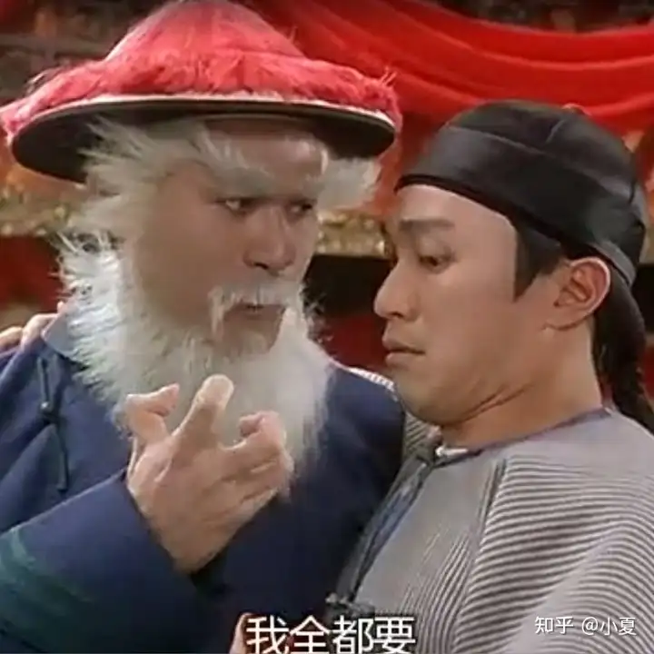

[toc]

# 问题

提问者：**<a href="https://www.zhihu.com/people/tomsheep">tomsheep</a>**
提问时间: 2025-11-2 16:58:20
总回答数: 233
总访问量: 1737157

研究领域对此有何解释？

# 回答

回答者： **<a href="https://www.zhihu.com/people/xiao-xia-82-7-31">小夏</a>**
回答时间: 2025-11-4 1:20:42
点赞总数: 16
评论总数: 2
收藏总数: 19
喜欢总数：0

这个图你看得出来是什么吗？

这个呢？

LLM的前身，是一种叫N-gram的模型。他的架构简单的要命，就是通读了人类有史以来所有的文字作品，自然而然有一个统计，然后根据这个统计结果输出。比如说，他发现A后面接B是最常见的，足足有10¹²次，于是当他在预测下一词的时候，就会在A后面接上B…这个模型完全没有考虑词与词之间的相互关联，自然也称不上智能

LLM在这个基础上加入了一些东西，把每一个词拆解成一个高维空间的向量，然后研究他们的相互关系，至于词本身，反而不是最重要的。你可以想象成围棋，N-gram研究的是单个棋子的落点，LLM研究的是第10手到第11手的路径

把这个路径研究明白了，自然就可以输出了。这其实是一个压缩-解压的过程。语料到LLM的内化结构，是压缩，这个结构到输出结果，是解压。这也是为什么你看起来他只是在“预测下一词”，但却可以对你的问题对答如流。因为他呈现的是“回答”这个事情本身，只是在输出结果上看起来有意义

说了这么多，那他到底是怎么涌现的呢？

这里就不得不提到一个假设，叫全息宇宙假设

以前我们中学的时候生物课讲过一个理论，一个细胞里也包含了该物种完整的遗传信息，这个叫做细胞的全能性。那么把这个结论推而广之，我们就假设一个原子，甚至一个夸克里也包含了宇宙全部信息。假如世界是可被压缩的，压缩之后再解压，就是LLM互动输出的过程。但是，我们现在普遍认为压缩是会丢失信息的，但实际上，很可能不是，问题只是在于你是否能读取出来

就像上面两张图片，原则上说任何图片都只是一堆像素块，你压缩到单像素，当然任何人都不可能还原该图片，但像素多到一定程度的时候，你突然就看出来是什么图片了。这就是涌现

那么他真的是涌现吗？按照我们的假设，其实不是。因为你其实也说不清楚具体多少像素能够被看出来。现在互联网上流行的meme图，用几个色块来表示一个梗图。过去，我们称之为过拟合，但这就表明了即使表面上看压缩已经完全失真，但仍然保留了一些关键信息

所以问题其实不在于“什么时候能够涌现”，而在于“什么时候能被你识别出来”。这就是康德说的“人为自然立法”，不是我要去认识世界，而是这个世界要被编译成能够被我认识的样子

  

原文地址：[(小夏)为什么 LLM 仅预测下一词，就能「涌现」出高级能力？](https://www.zhihu.com/question/1968361285579150015/answer/1968850095165383893) 

