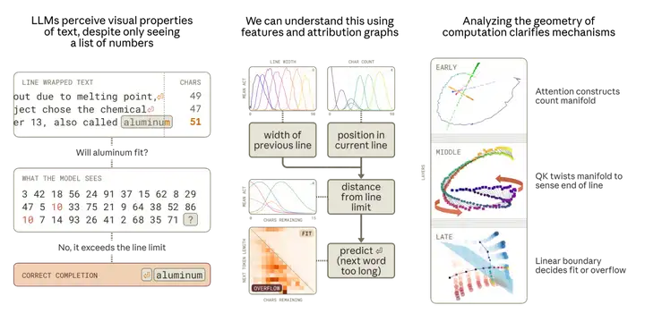

[toc]

# 问题

提问者：**<a href="https://www.zhihu.com/people/tomsheep">tomsheep</a>**
提问时间: 2025-11-2 16:58:20
总回答数: 233
总访问量: 1737155

研究领域对此有何解释？

# 回答

回答者： **<a href="https://www.zhihu.com/people/he-luo-wu">屁屁怪他爸爸主人</a>**
回答时间: 2025-11-4 17:34:53
点赞总数: 174
评论总数: 8
收藏总数: 308
喜欢总数：7

这篇论文反驳了“涌现”也反驳了“智能”：

[来自圣塔菲：大语言模型有能力，而无智能](https://mp.weixin.qq.com/s/qwGT6TKr2ZR0TMDBRGJyrQ?scene=1&click_id=3)

它的观点简单说就是：大模型其实很大很笨——这种笨不是表现出来的笨，而是训练和推理过程的笨（费人费电费服务器），它是用庞大的参数和数据堆砌出的结果，它的运作原理可能是笨拙的、不智能的。

论文搬出了复杂科学里对“涌现”的严格定义——真正的涌现，是系统内部发生了重组，产生了新的、更简洁的描述方式。这种新的描述，即“有效理论”，允许我们抛开微观细节来预测系统的宏观行为。就像我们用流体力学描述水流，而不需要追踪每个水分子的运动。

圣塔菲研究所是搞复杂系统出身的，为了把对大模型的研究纳入“涌现”的经典话语体系内，论文提出了一个区分：“知识外放型”（KO）系统和“知识内嵌型”（KI）系统。物理化学里的涌现，比如结晶，是KO系统的涌现：简单的组件（原子）遵循简单规则，自发产生了复杂的宏观结构。

而生物、经济和LLM，被划分为KI系统：它们是 **通过学习、演化或训练，从复杂的环境（或海量数据）中“吸取”知识，形成复杂结构** 。在KI系统里，“涌现”指的是为了预测，系统内部产生了新的、简洁的、粗粒化的描述层级。

以下是对论文对“涌现”的定义的原文引用：

> 一般而言，涌现的核心方面在于新颖或可压缩的结构与功能的出现。涌现的第二个方面在于，这种结构和功能可以“自然而然”地产生，即自组织或更基础的物理化学过程，它们通过能量最小化的过程产生有序状态。我们可以说，当至少满足以下部分条件时，“涌现”一词就是站得住脚的：  
>  **涌现的条件**   
> 缩放性：随着通用组件的缩放，会出现一种新的内部组织，这种组织适合进行全新且简洁的描述。  
> 临界性：系统经历快速或非连续性变化，如控制变量中的相变，此时新的组织适合进行全新描述。  
> 压缩性：模型利用模型内部的压缩表征来提高表征的保真度或效率。  
> 新基底：发现新的基础或函数，为编码规律性提供一种内部的“字母表”。  
> 泛化：在适应性系统中，从一个任务中产生的能力可用于解决不同的任务，从而使得由离散性能联合产生的能力成为可能。

### 先说作为人类用户感觉到的“涌现”，是怎么发生的

早期参数量小、训练数据小的模型，并没有表现出如今大家体验到的商用大模型这般的能力，因此，从体验上来说，一定存在某个“临界点”，让人开始觉得“机器开始变得非常会说话”“比人都聪明”，此时会认为“涌现”发生了。

“临界点”之后，人类的预期又会急剧上升，期待它能“真正理解”，对模型的错误感到惊讶，甚至恼火，使用“幻觉”来描述模型的错误，好像它们只是意外。

如果用这种方式来理解“涌现”，那么，这个临界点就是发生在GPT-3（2020年）到它的后续变体InstructGPT或ChatGPT（2022年）的演进过程中。

最经典的那篇论文《LLM的涌现能力》（Emergent Abilities of Large Language Models）主要对比了GPT-3 模型家族、谷歌PaLM 模型家族、DeepMind Gopher 模型家族不同参数量模型的表现。比起小参数的模型，大参数的模型各种能力自然有极大提升，但因为实验对模型参数量的采样不是连续的（客观条件不允许），也就没有办法说明，比如从130亿 (13B)参数到1750亿 (175B)的模型，表现提升是突然发生的，还是平稳上升的？如果是平稳上升，从直觉上，也很难相信，模型内部因为出现了一个什么新的机制，从而提升了表现。

如果说研究人员先是在GPT-3上发现了让人激动的进步，那么后续过程里，模型表现的进一步进步，又加入了更多的影响因素，也就是现在说的微调和强化训练。

OpenAI在GPT-3之后、ChatGPT之前推出了InstructGPT，它的成功直接导致了ChatGPT的诞生。

GPT-3还是补全模型，也就是不是基于对话数据去训练的，而InstructGPT开始使用“指令-回答”数据训练，并且开创了我们后来熟知的“基于人类反馈的强化学习”（RLHF - Reinforcement Learning from Human Feedback）。

>  **如果对相关概念还不熟悉，可参考：**   
> 监督微调： 先雇佣了一批人，写下各种各样的指令，并写出高质量的“示范答案”。然后，用这些“高分答案”去微调GPT-3，得到一个“监督模型”（SFT）。这个模型已经比原始GPT-3听话了。  
> 训练奖励模型： 让第一步的SFT模型，对一批新指令生成好几个不同的答案（比如A、B、C、D）。然后，他们再请人类来给这些答案排序，比如“A最好，C其次，B和D一样差”。用这些“人类偏好”数据，训练出了一个“奖励模型”（Reward Model, RM）。这个RM的工作，就是给AI生成的任何答案打分，分数高低代表了人类的喜好程度。  
> 强化学习： 让SFT模型（第一步那个）不断地去回答新指令，然后用第二步的“奖励模型”给它的答案打分。SFT模型的目标，就是想办法让自己生成的答案，能从“奖励模型”那里拿到尽可能高的分数。这个刷分的过程就是“强化学习”。

InstructGPT就是这么被“调教”出来的。

让人惊讶的就是，一个只有13亿参数的InstructGPT，在“听话”和“有用性”上的表现，被人类测试员压倒性地偏爱，甚至超过了1750亿参数的巨无霸GPT-3。

这说明模型“更大”不一定就“更好”。通过RLHF技术，让模型对齐人类的“意图”，比单纯上参数要高效得多。

InstructGPT证明了RLHF这条路的成功，而ChatGPT，就是让InstructGPT进一步变成一个对话机器人“产品”，训练手法没区别，只是用更多轮次的对话去训练模型，把human/assistant的角色标记变成模型的思想钢印，让模型认真对待human的发言，扮演好一个忠诚友好的assistant。

因此，大家就会怀疑——我们体验到的无比聪明（以及会说好听话）的大模型，会不会，更多是因为，它们被大量“更优质的数据”训练后的结果？

### 模型到底有没有学会人类没有教给它的东西？

答案我觉得是肯定的。

比如说，10月底 Anthropic 的研究人员发表的《当模型操作流形：计数任务的几何学》（When Models Manipulate Manifolds: The Geometry of a Counting Task），发现模型在生成一些有固定宽度的格式要求的文本的时候，内部有一个“计数机制”。

这套机制需要追踪：当前行已经写了多少字符（当前位置），这行的总宽度限制是多少。模型会计算出“剩余空间”，然后结合它打算生成的下一个词的长度，来判断这个词是该放在当前行，还是必须另起一行。

研究人员用归因图的方法追踪这个计算过程，发现模型内部确实形成了代表“行宽”、“当前位置”、“离行尾的距离”等概念的“特征”。

这并不是事先告诉模型“接下来生成的文本每行只能有XX个字”，也没有告诉模型“你要用减法来计算该不该换行了”，而是模型在海量的文本训练中，为了更准确地预测下一个字符（尤其是预测是否该换行），自己“摸索”出了这样一套内部算法。

模型看到的不是一条“明文规则”，而是成千上万个“范例”。它观察到，在某些类型的文本中，一行文字总是在达到某个（它自己推断出的）长度界限时，就出现一个换行符。而它就自行“发明”了一种方法，能准确预测了换行符每次出现的位置。

研究人员称这种固定宽度的格式为“隐性约束”（implicit constraint）。我认为可以合理推测，在面对其它“隐性约束”的时候，模型内部还有许多类似这种“工具”，用来解决相应的预测任务。

这个例子不是为了说明这个任务对模型有多么难，因为根据人类的直觉，这不就是数数嘛？关键在于，这是模型自己发现的规律，并发展出一种精确的工具来预测。

这其实已经符合圣塔菲研究所对涌现的定义。但是不是符合它们对智能的定义，我就不知道了，因为论文里也没有说清楚他们认为什么才叫智能。

### 弱方法的胜利

生成连贯、有意义的、能“自圆其说”的、知识准确的文本，并不是一件容易的事。但不是不可能完成，因为语言本身是有意义的、有结构的，一句话、一段话，如果没有意义、前后矛盾，摆在任何一个受过基本教育的人面前，都能被认出来，这意味着语言可以被学习。问题就在于怎么让机器去学。（但连贯的文本跟“知识准确”的文本是两件不同的事，这也埋下了“幻觉”问题）

预测下一个词，至少已经被验证了，是目前最有效的让机器学习语言的方式。这也是萨顿说的“弱方法”的胜利，这可以说是一种哲学理念，但也是被广泛认同的理念，也就是不要去给机器灌输规则，只要给机器设定目标，它自己会找到完成这个目标的策略。

这个理念被认为适用于一切智能体。包括人类在内的智能体，都是为了达到某个目标，而产生学习/试错行为，而在为了实现某一类目标的过程中，又会派生出其它的“目标”。引用明斯基在《心智社会》中的一段话：

> 从某种意义上讲，我们永远无须真的去创造新的“高水平”目标。……假设一个婴儿最初的目标是够到一个特定的杯子。这可能会产生一个子目标，也就是学会如何高效地移动手臂和手，这个子目标又会产生另外一些子目标，学会移动周围的障碍物。这可能会持续下去，演变成越来越一般、越来越抽象的目标，也就是如何理解和管理物理的空间和时间世界。于是我们可能是从卑微的目标开始，但最后产生的一些子目标带领思维进入了我们可以构想出的最具雄心的事业中……同一个婴儿，这次形成的子目标是利用别人的帮助把杯子递给他。这会使他尽力寻找有效的方式来影响其他人，于是这个孩子可能会开始关注如何表述和预测其他人的动机和性格倾向。以前，喝水是一个相对朴素目标，但它能引发更强大的能力，比如这一次就发展出了理解社会互动的能力……无论一个人的问题是什么，只要这个问题足够困难，他就能从学习过程中学到更好的方式。

我相信未来会有越来越多的证据，来证明，在经得起推敲的定义下，模型也是有“涌现智能”的。

### 一个合理猜测：

用更优质的数据训练过的模型，更有可能涌现出高级能力。

比如“换行机制”，之所以它可以说是一个涌现的能力，因为它是一种压缩。因为数据里有一条隐性的规则。模型为了完成“预测下一个词”这个总目标，最高效的出路，就是“发现”那条规则。

“优质”的数据，就是数据里蕴含的“可压缩性”更高，里面有“原理”“结构”可寻。

所以，当用人类检验过的“高分答案”去训练模型，模型更可能从里面“学到东西”，学到大量高分答案内在的结构。

“高分答案”不仅仅是对人类的显性偏好的对齐，也让模型学会了更优质的规律。

  

原文地址：[(屁屁怪他爸爸主人)为什么 LLM 仅预测下一词，就能「涌现」出高级能力？](https://www.zhihu.com/question/1968361285579150015/answer/1969095256516559798) 

