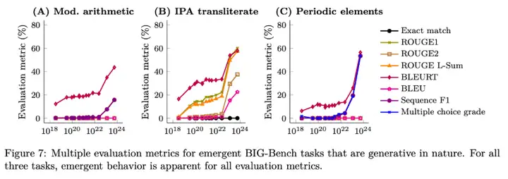

[toc]

# 问题

提问者：**<a href="https://www.zhihu.com/people/tomsheep">tomsheep</a>**
提问时间: 2025-11-2 16:58:20
总回答数: 233
总访问量: 1737188

研究领域对此有何解释？

# 回答

回答者： **<a href="https://www.zhihu.com/people/fu-jie-57">捷哥AI超级个体</a>**
回答时间: 2026-1-29 11:26:29
点赞总数: 0
评论总数: 0
收藏总数: 0
喜欢总数：1

“只做下一词预测”这句话很容易骗过直觉：你以为它在做填空题，其实它在被迫学一个压缩版的世界。

因为自然语言不是随机噪声。你随口一句“他把杯子放在桌上”，下一词的概率分布背后藏着一整套隐含结构：语法约束、指代与一致性、常识物理、因果顺序、社会语用、甚至“这句话通常在什么场景被谁说”。

为了把交叉熵损失压下去，模型必须在内部形成能复用的中间表征——不然它只能死记硬背，泛化会炸。规模一上来，这种“被迫学到的可复用结构”就开始显性化，表现为你看到的推理、写代码、做规划。

现在大概有三条解释线索，彼此不互斥。

第一条是“平滑进步 + 阈值测量 = 看起来像涌现”。语言模型的核心损失（预测误差）随参数、数据、算力呈幂律下降，整体很平滑。  
但很多能力的评测是硬阈值：多步算术错一步就是零分，选择题差一点也全错。于是底层能力其实在连续增强，到了某个点跨过阈值，你在指标上就会看到“突然会了”。

![[images/21捷哥AI超级个体01.webp]]

这就是“涌现是否是幻觉”的核心争论：Schaeffer 等人直接指出，很多所谓涌现会随着度量方式变化而“蒸发”。 也有人专门讨论过“硬指标放大跳变”的现象。

第二条是“训练动力学里确实会出现结构相变”。哪怕指标幻觉成立，也不等于模型内部没有“突然长出新电路”。

机制可解释性这边给了一个很硬的例子：induction heads（归纳头）会在训练中某个阶段出现，并与 in-context learning 能力的跃迁相关，甚至能在小模型里做因果验证。  
更一般地，深度学习里长期存在“grokking/相变式泛化”：先记忆、后突然学会规律，像延迟爆发。  
所以“看起来突然”有两种来源：一种是你用尺子量出来的假台阶，另一种是系统真的在某些瓶颈处完成了结构重组。

第三条是“下一词预测在做隐式多任务与隐式学习算法”。预训练语料里混着无数任务的痕迹：解释、证明、代码、对话、辩论、教程、总结……最大似然会把这些模式一起吸进同一个模型里，于是模型学到一种“在上下文里拟合任务”的通用套路。

![[images/23捷哥AI超级个体03.png]]

有人把它形式化为：Transformer 的前向传播在近似执行某种学习算法，像梯度下降或线性回归被编码进激活里。  
也有人把 ICL 解释成“隐式微调/元优化”。 甚至最新工作在更强的设定里讨论“在上下文里做（近似）贝叶斯推断”的可能性。

把这三条线索叠起来，你会得到一个更接近真相的版本：所谓“只预测下一词”，本质是在逼模型学会对世界与任务的高效压缩；压缩做得越好（损失越低），可泛化的结构越多；指标阈值会把连续进步切成台阶；而训练过程中某些可复用电路与表示方式也确实会在特定阶段形成。

如果你想用一句话把它讲透：下一词预测不是低级目标，它是把“理解、记忆、推断、规划”这些能力打包进同一个可微分压缩任务里的最便宜方式。规模只是把这件事从“隐形”推到“肉眼可见”。

  

原文地址：[(捷哥AI超级个体)为什么 LLM 仅预测下一词，就能「涌现」出高级能力？](https://www.zhihu.com/question/1968361285579150015/answer/2000167904461730717) 

