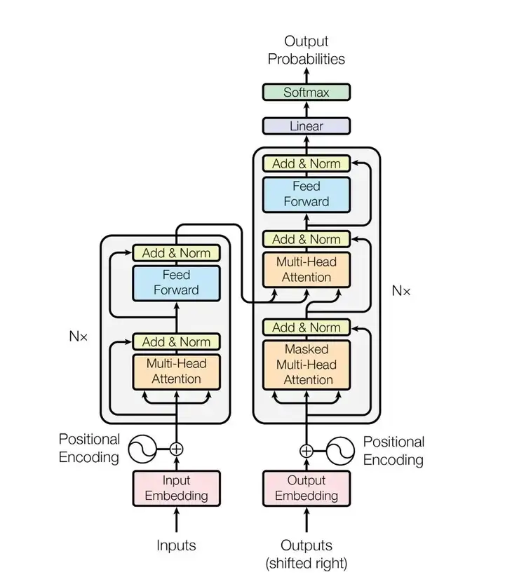
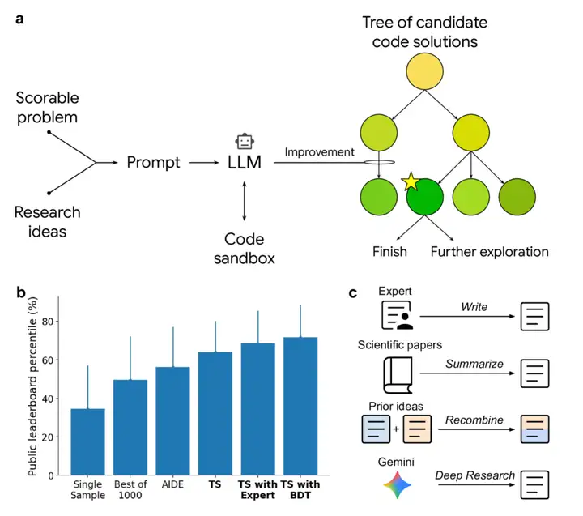

[toc]

# 问题

提问者：**<a href="https://www.zhihu.com/people/tomsheep">tomsheep</a>**
提问时间: 2025-11-2 16:58:20
总回答数: 233
总访问量: 1737157

研究领域对此有何解释？

# 回答

回答者： **<a href="https://www.zhihu.com/people/san-mu-73-96">杰拉德笔下的男人</a>**
回答时间: 2025-11-3 9:49:35
点赞总数: 19
评论总数: 6
收藏总数: 22
喜欢总数：13

这个所谓的「涌现」形容的不太准确或者说贴切。应该是必然的结果。

我用白话文回答下这个问题，尽量都能讨论下。

为了方便不是业内人士阅读，首先咱们再说大模型中的几个互联网式的缩写或者黑话以及代表的产品，降低下参与难度。

LM就是大模型，第一个L是large ；LLM就是大语言，第一个L是large，第二个L是language 语言意思。它不再只是 **猜词，而是表现出了推理、编码、创作等高级能力。代表是ChatGPT。** 

AIGC，人工智能生成内容，用AI生产的内容或者应用。可以理解是就是用ChatGPT写的文章。AGI也就是追求的终极形态，希望达到的样子，通用人工智能，目前市场还没有。

有了这4个缩写，再来理解问题可能就更容易了。

 **涌现听起来像魔法，强迫或者必然才是逻辑。** 这不是什么玄学，而是一种极致的暴力美学下，必然发生的副产品，从人工智障到人工智能。

就像是你两岁时，你妈叫你名字，你话说不好只能懵圈的看；等你到三岁，你妈叫你名字，你会跑过去；等你到了5岁，你妈叫你名字，你会根据你是不是在玩玩具或者思考你妈当时情绪，回应或者不回应。随着年纪增长、见的人越多、生活环境改变就有了所有的心思。

预测下一个词，听起来很简单，但这个在人工智能领域，真的实操起来巨难。数据容量、训练能力、钱、芯片需要的人力物力资源是很多公司不能负担的。

很多人以为，预测下一个词这不就是完形填空吗？比如：苍茫的天涯——我的爱，大锤——80。

但是这是统计学，而不是逻辑学。因为他考虑的是出现的频率，而不是因果关系，属于表层规律。对于小模型，或者在简单数据集上，它是完形填空。模型学会的只是「天气」后面大概率跟好/不错/晴朗这中高频形容词。

现在，LLM的训练数据是什么？几乎是全人类的文明语料库。有物理论文、有剧本、有网络对话、有数学证明还有社区问答等等。

现在，你再问它「苍茫的天涯」，可能就不再是「我的爱」，而是关于地理环境或者自然生态方面的。

这就是第一个关键逻辑：当训练数据变得无限复杂时，预测下一个词这个任务的难度，被拉高到了一个变态的程度。

为了把把损失函数降到最低可以理解成把这个猜词游戏玩到极致，模型不能再靠死记硬背。因为数据太庞大了，硬背的性价比太低。

所以模型，必须走理解道路。为了预测物理论文的下一个词，要学习因果关系，因为有重力，所以物体会下落；为了预测代码的下一个词，它要学习编程逻辑，比如循环和条件。为了预测侦探小说中的凶手，需要学习动机和线索。

大模型并不知道什么是物理或逻辑。它只知道，如果我构建一个这样的内部参数结构，我在预测所有这类文本或者类型时，准确率会高得多。

 **为了把几万亿字节的人类知识压缩进几千亿个参数里，最经济的办法，就是提取规则。而智能，就是规则的产物。** 

同样，Siri 为什么不行或者为什么说人工智障，因为它存储量、训练量、数据都不够，只能靠死记硬背，属于记忆模式。就像你跟一个三岁小孩讲话，他不知道你谁，只能已读乱回。而你和大学生说话，他大脑发育的比小学生多的多，见识学识都要好，所以你和他讲话，他不会凭背诵的东西回你，而是形成了主谓宾的回答模式。

 **同样当参数规模跨过某个临界点后，模型从记忆模式切换到抽象模式的性价比突然变高了，也更加智能了。** 

回到开头说的我为什么说「涌现」不太准确呢，能力从来不是突然出现的，而是不断的学习进化的，非对即错的测量能力方式太过于粗糙。

比如，你高中生毕业体育100m成绩，所有人及格线就是13s，你第一年跑了20s，你就是差生；给你定性了；第二年18s，还是差生；第三年你怕你毕不了业，你开始增肌训练，毕业你跑了10.58s，震惊校长，他就说你是最牛体育生。他凭借这一次结果就下了定义。

对于用户来说，这种突然及格的体验，就是涌现。

 **我说这个例子是想表达，涌现可能不是一个魔法时刻，而是一个量变引起质变的必然结果。因为你日复一日增肌、你训练、你控制饮食拿到的成绩。** 

LLM最不可思议的能力，其实不是做数学题写内容， **而是一个叫上下文学习的东西。** 

举个例子，你和他对话，输入把中文翻译成英文，你好——hello 。然后你再问他，把中文翻译成英文，再见——？他可能秒回bye 。

这种举一反三的能力和你学习路径是一样的，看了无数QA问达、学习过找规律、看过无数演练、有大量知识储备。

当它的规模大到可以抽象规则时，它学到的最牛逼的规则之一，就是模式匹配与复制。

当你给它一个“你好——hello”的例子时，你就激活了它内部学到的那个翻译模式。它意识，这个用户正在玩中译英这个游戏，我以前在语料库里见过这个模式。

然后，当你给它时“再见——？”，它要做的，就不是在整个语料库里瞎猜了，而是在它刚刚被激活的中译英模式下，预测下一个词。

它不是在学习，而是在模仿它见过的学习模式。

这也是人工智能的一个标准，有没有思考能力或者思考能力如何。

 **LLM在海量数据中寻找模式，它最终找到了人类文明中最高级的模式——逻辑、推理、因果、以及如何遵循一个模式的元模式。** 

所以说，我说LLM从来不是突然的涌现的，而是在不断的训练进化而来的。高能力也不是某天获得神力突然，而是在学习反馈中提升的。

感谢各位观看。

我是 [@杰拉德笔下的男人](https://www.zhihu.com/people/70aca11020c89db15b29d6fc32ab94b2) ，不定期更新分享互联网产品、运营知识。

  

原文地址：[(杰拉德笔下的男人)为什么 LLM 仅预测下一词，就能「涌现」出高级能力？](https://www.zhihu.com/question/1968361285579150015/answer/1968615774848517380) 

