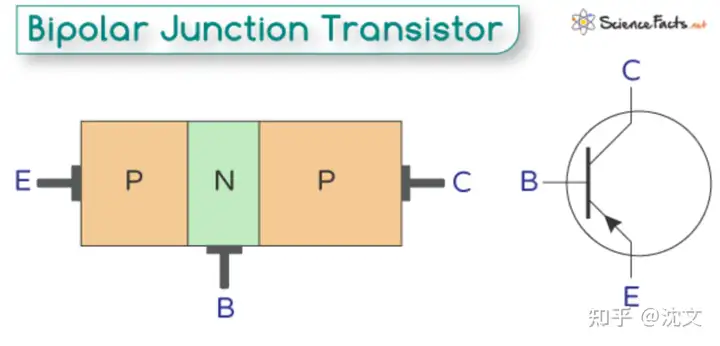

[toc]

# 问题

提问者：**<a href="https://www.zhihu.com/people/tomsheep">tomsheep</a>**
提问时间: 2025-11-2 16:58:20
总回答数: 233
总访问量: 1737159

研究领域对此有何解释？

# 回答

回答者： **<a href="https://www.zhihu.com/people/chen-wen-40">沈文</a>**
回答时间: 2025-12-29 19:51:11
点赞总数: 2
评论总数: 0
收藏总数: 1
喜欢总数：0

量变到质变。

其实质变就是超出逻辑思维理解的部分。

类似三级管其实很好理解：一根电线上装了一个开关，平时电线不导通，给开关一个电压，电线就导通。

如上图，给B一个适当的电压，E->C 就导通。B不给电压，EC之间如同绝缘体，不能通过电流。

gpt的解释：B就像一个水龙头开关。我相信你给一个学过初二物理的人，都可以理解。

## 然而三极管足够多，就可以组成我们平时用的计算器，可以做复杂的四则运算，甚至还能开根号。

## 再多一点，就可以处理数据，跑程序，运行数据库。

另外，其实三极管之所以叫三极管，因为他是由两个二极管组合起来的。当然这里面会涉及物理知识，暂且略过。

再然而实际99.99%的人都很难直观理解一堆“开关”是怎么可以实现四则运算的，跑超级玛丽这样的游戏更像是天方夜谭了。

\* 对了，其实第一台做数学运算的“电动计算器”就是由继电器组成的，那玩意儿是真的开关。

  

原文地址：[(沈文)为什么 LLM 仅预测下一词，就能「涌现」出高级能力？](https://www.zhihu.com/question/1968361285579150015/answer/1989060889375154592) 

