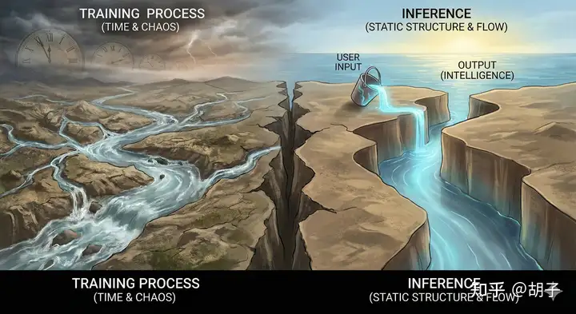

[toc]

# 问题

提问者：**<a href="https://www.zhihu.com/people/tomsheep">tomsheep</a>**
提问时间: 2025-11-2 16:58:20
总回答数: 233
总访问量: 1737172

研究领域对此有何解释？

# 回答

回答者： **<a href="https://www.zhihu.com/people/dcjojo">胡子</a>**
回答时间: 2025-12-30 11:37:49
点赞总数: 0
评论总数: 0
收藏总数: 0
喜欢总数：0

根本原因是现在的智能算法追求信息熵和能量效率。

原始的自然语言数据在高维空间中是杂乱纠缠的（高熵状态）。模型的训练过程（启发式算法支持下），就是为了找到一个低维流形，将这些复杂的数据 **拓扑结构** 理顺。当数据被“理顺”后，流形上的测地线（最短路径）就代表了思维模式或逻辑推理的路径。所谓的「抽象概念」，就是这个流形上的关键拓扑节点。而这个思维过程本身可以形成时间分量从而纳入静态模型结构。

在启发式算法支持之下，推理的预测过程是和语义划分训练过程是相辅相成的。信息组织方式会自然而然的往低能量驱动强知识结构的方向去组织，而这个组织过程中，因为采用了自监督的算法，所以自然而然出现时间分量的词向量维度，这种维度并不是静态知识结构，而是动态思考过程时间分量上的静态向量表现。这种思考过程的向量仅仅支持思考过程，所以表现出对于静态知识结构的”抽象“的能力。这就使得在推理（预测）过程中会出现基于抽象概念的思考表达。

当算力和模型足够大的时候，预测过程表现出基于抽象概念的思考过程并能够实现思维逻辑闭环。哪怕思维和抽象是不正确的，但是因为最终预测出来的词，在用户眼中只会关注到涵盖静态语义的那部分分量，用人脑”补足了“其中的关联关系。

___

>  _下面内容是用Gemini帮忙扩写的，和我想表达的略有出入，但是作为科普应该够了。将就看看吧。_   
>  _AIGC一字未改！老外模型的中文表达也是有点别扭……_ 

## 第一章：智能的第一性原理——追求低熵与高能效

这一章我们不谈代码，先谈物理。智能的本质，可能是宇宙中物质为了对抗混乱（熵增）而产生的一种“节能策略”。

### 1.1 预测是为了“省力”

在这个充满不确定性的宇宙中，如果不确定性（熵）太高，生存就需要消耗巨大的能量去应对突发状况。LLM（大语言模型）的训练本质上是一个 **熵减过程** 。

-    **信息熵的最小化：**  “预测下一个词”看似简单，实则是要求模型对世界的运行规律有极其精准的把握。只有完全理解了上下文的逻辑，预测的不确定性（熵）才会降到最低。
-    **能量效率算法：**  所谓智能，就是在信息处理层面寻求一条“能量最低”的路径。当模型通过梯度下降（一种启发式搜索）找到了最优解时，它实际上是发现了一种最高效的信息组织方式。

### 1.2 语义流形：在混乱中切分出秩序

数据原本是杂乱无章的，但为了“省力”，模型必须学会归类。

-    **高维流形（Manifold）：**  模型在训练中，将语义相似的概念在数学空间中拉近，形成“流形”。这不仅仅是名词的归类（如苹果和梨），更是逻辑的归类（如“因为”和“所以”）。
-    **抽象的诞生：**  这种为了高效存储和调用而进行的“语义切分”，自然催生了 **抽象** 。抽象是信息的极致压缩，是高能效的体现。

___

## 第二章：被冻结的时间——静态模型中的动态思维

在理解了智能是“追求低熵”的本质后，我们必须面对一个最反直觉的问题： **为什么一个训练完成、参数不再改变的“静态文件”，能够表现出逻辑推理这种“动态过程”？** 

答案藏在高维向量的双重身份里。

### 2.1 向量的二象性：既是坐标，也是算子

在绝大多数科普中，词向量（Word Embedding）被比喻为地图上的 **坐标** 。

例如，在数学空间里，“国王”和“王后”的距离，等于“男人”和“女人”的距离。这种解释虽然直观，但它只描述了知识的静态存储，却忽略了智能的核心—— **相互作用** 。

如果你只把向量看作坐标，那它们就是死寂的星星，孤立地悬挂在黑暗中。但在大模型（Transformer架构）中，向量更准确的定义应该是 **算子（Operator）** 。

> 从“位置”到“力场”

在量子力学中，算子是对波函数进行变换的一种操作。同样，在语言模型中，一个词向量不仅仅是一个名词，它更像是一个 **自带力场的磁铁** 。

当你输入“把”这个字时，它对应的向量不仅仅占据了一个位置，它还向周围的空间释放了一种“引力场”。

-    **作为坐标时** ：它代表一个介词。
-    **作为算子时** ：它对后续出现的向量施加了强大的约束力（也就是降低了系统的熵）。它“要求”后面必须出现一个可被移动的名词（如“书”、“椅子”），并对接下来的动词施加了“位置移动”的语义变换。

 **这就是为什么“静态”能产生“动态”的第一层原因：**  词与词之间不是简单的排排坐，而是如同化学反应一般，向量作为算子，在输入的那一瞬间，对上下文的语义空间进行了极其复杂的 **扭曲和折叠** 。这种相互作用，就是推理的微观本质。

### 2.2 思维的“化石”：时间维度的空间化

如果说“算子”解释了推理的动力，那么“高维空间”则解释了推理的路径。

我们通常认为，思考是一个线性的时间过程：因为 A，所以 B，进而 C。这需要时间流逝才能完成。但在大模型的训练过程中，这个 **时间轴被折叠进了空间轴** 。

> 能量峡谷：大自然的算法

如果你依然觉得‘把时间变成空间’听起来很玄幻，不妨想象一下大自然中最杰出的能量工程师——河流。

河流寻找入海口的过程，最初是充满不确定的探索（高熵）。但经过亿万年的冲刷（训练），水流在岩石上刻出了精确的峡谷（静态向量结构）。

此刻，当我们往峡谷源头倒下一桶水（用户输入），水流无需再进行那亿万年的‘思考’与试错，它只需顺着岩壁的几何结构，就能瞬间找到那条能量最低的完美路径。

我们眼中的‘智能涌现’，本质上就是这道 **被时间雕刻出来的空间结构** ，在引导着信息以最高效的方式流动。

> 瞬间的推理

现在，当用户输入一个问题，就像是往峡谷源头倒了一桶水。 这桶水需要重新“思考”往哪里流吗？不需要。它只需要顺从重力，沿着岩壁的形状滑落。

 **用户眼中的“推理”，实则是信息在“能量低谷”中的滑行。**  那些复杂的逻辑推演（时间维度上的 Steps），已经被转化为了高维空间中复杂的拓扑结构（空间维度上的 Dimensions）。模型不需要现场推导“三段论”的逻辑，因为“三段论”的逻辑结构早已变成了高维空间里的一个平滑的滑梯。

这就是为什么静态模型能拥有“思维”—— **它拥有的不是正在进行的思维，而是思维过程留下的、被空间化了的轨迹。** 

### 2.3 高维向量对应思维过程的抽象表达

当我们说模型维度高达 4096 甚至更高时，这些维度里到底装了什么？

既然“时间被折叠进了空间”，那么高维向量中的很大一部分维度，存储的不再是具体的“知识点”（如苹果是红色的），而是 **抽象的“思维模型”** 。

在低能量驱动的组织方式下，自监督算法强迫模型学会了“抽象”。因为“抽象”是压缩信息最高效的方式（熵最低）。

-   模型不会为每一对因果关系单独存储路径。
-   它会把所有的“因为……所以……”抽离出来，形成一个通用的 **逻辑算子维度** 。

当你看到模型表现出惊人的举一反三能力时，它并非在“创造”，而是在调用那些 **代表着“思考过程”的向量维度** 。这些维度是动态思考过程的静态表现，支持着完整的思维闭环。

___

## 第三章：推理的幻象——从微观算力到宏观涌现

当我们把训练好的大模型部署到服务器上，那个曾经疯狂消耗能量来“冲刷峡谷”的训练过程结束了。现在，模型进入了推理（Inference）阶段。

许多人认为，“预测下一个词”听起来像是一个简单的填空题。但正如我们在前文所言，如果这个“填空”依赖的是一个蕴含了宇宙逻辑的能量流形，那么这个过程本身，就是思考。

### 3.1 激活思维链条：完整的算法闭环

当你在对话框里输入问题并按下回车的那一刻，发生了什么？

你输入的不仅仅是一串字符，你其实是输入了一个 **初始的能量状态** 。这个状态激活了模型内部那个庞大而静止的神经网络。

-    **隐性的推理（Implicit Reasoning）：**  在这毫秒之间，数据流穿过了数十亿个参数构成的层级。这并不是简单的查字典。每一层，向量都在进行着剧烈的旋转和变换。 还记得第二章提到的“向量是算子”吗？第一层的输出成为了第二层的输入，前一个逻辑算子激活了下一个逻辑算子。 虽然模型没有在时间轴上“停下来思考”，但在深度轴（Depth）上，它完成了一次完整的逻辑推演。 **数据的流动过程，就是算法闭环的执行过程。** 

### 3.2 冰山一角：用户眼中的“静态语义”

作为用户，我们往往被结果蒙蔽了双眼。

当屏幕上跳出一个字，比如“故”，紧接着跳出“以”，我们看到的是一个静态的词语接龙。我们容易产生一种错觉：模型只是在计算概率，找一个最常见的词填上去。

-    **波函数的坍缩：**  借用量子力学的一个比喻：在输出那个具体的词之前，模型内部的状态像是一个复杂的“波函数”，叠加了无数种可能含义、逻辑关系和抽象概念。 当模型最终输出一个词（Token）时，就像是波函数坍缩成了一个确定的粒子。
-    **看不见的冰山：**  用户只看到了海面上的冰山一角（最终的词），却看不见海面下那庞大的冰山基座（支撑这个词被选中的深层逻辑链条）。 为了精准地预测出这 **一个词** ，模型可能在后台调用了关于“因果律”、“情感分析”甚至“道德判断”的高维抽象向量。 **你看到的是一个词，模型经历的是整个世界。** 

### 3.3 涌现的真相：思维过程的语义化表达

至此，我们可以回答那个核心问题： **为什么仅仅预测下一个词，就能“涌现”出高级能力？** 

这就是量变引起质变的物理魔法。

-    **当算力不足时（低维空间）：**  模型只能捕捉到简单的共现关系（比如“苹果”常和“好吃”在一起）。此时的能量峡谷很浅，路径很单一，没有“智能”。
-    **当算力和维度足够大时（高维流形）：**  为了在如此复杂的语料中实现“最低信息熵”的预测，简单的死记硬背已经失效了（能耗太高）。模型被迫学会了 **抽象** 。 它被迫在向量空间中构建出“逻辑”、“数学”、“编程”、“反讽”这些高级思维过程的静态结构。

 **所谓“涌现”，并不是无中生有。**  它是当模型为了极致的预测准确率，不得不去 **模拟** 人类的思维过程时，这种思维过程在输出端的一种自然投影。

模型并非“想要”思考，而是为了完美地预测下一个词，它 **不得不** 学会思考。预测是目的，而智能，是实现这个目的时最高效（最低熵）的手段。

___

## 结语：熵减的胜利

为什么 LLM 仅预测下一词就能拥有智能？

因为在信息论的视角下， **能够对未来做出最高效、最精准预测的系统，必然是那个对过去和现在理解得最深刻的系统。** 

在这个由高维向量构成的晶体宇宙里，时间被折叠成了空间，动态的思维被压缩成了静态的结构。每一次简单的“预测下一个词”，都是一次在这个能量最低的流形中，对人类智慧逻辑的重演。

这不仅仅是计算机科学的胜利，更是热力学第二定律在信息世界的某种奇妙回响——为了对抗混乱，智能由此诞生。

  

原文地址：[(胡子)为什么 LLM 仅预测下一词，就能「涌现」出高级能力？](https://www.zhihu.com/question/1968361285579150015/answer/1989299121174123281) 

