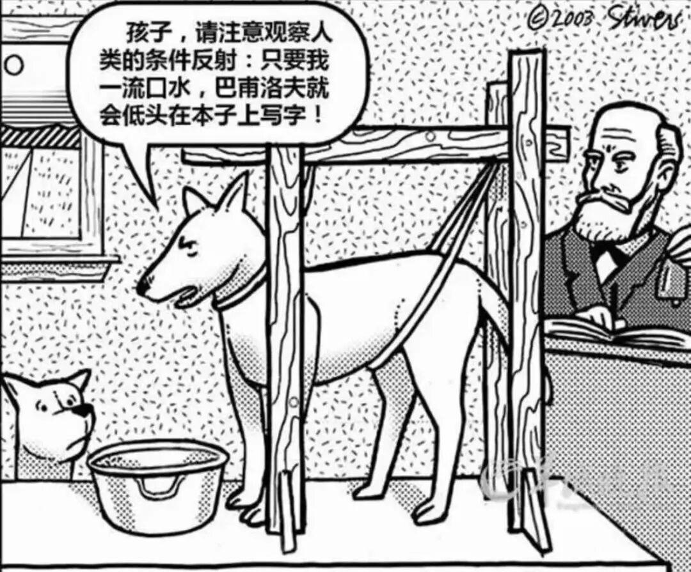
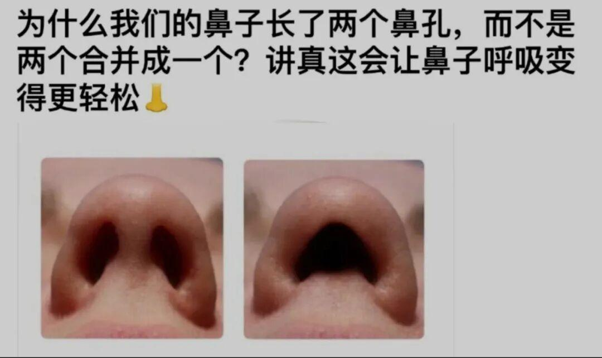
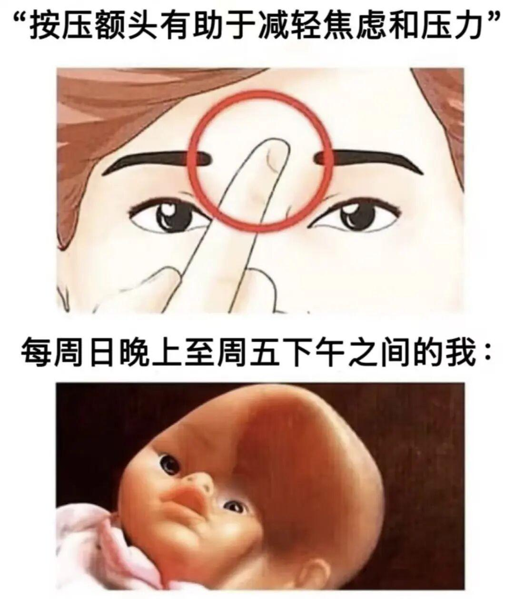
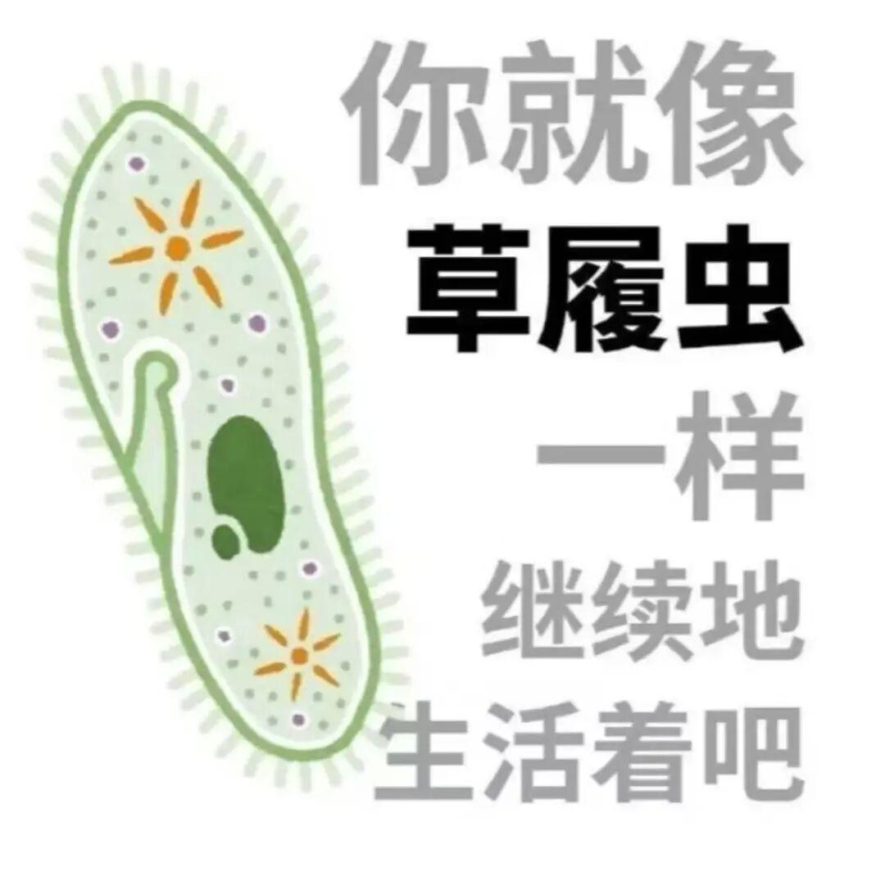
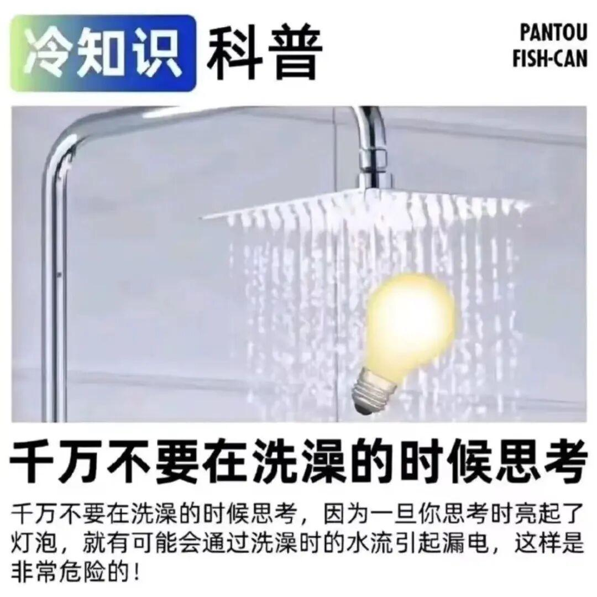
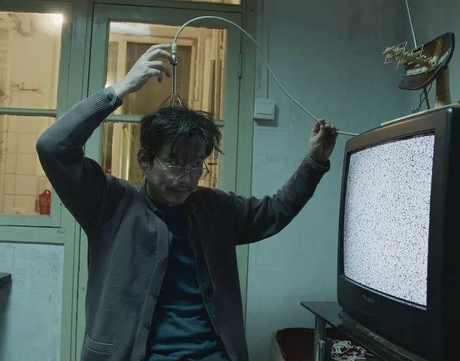
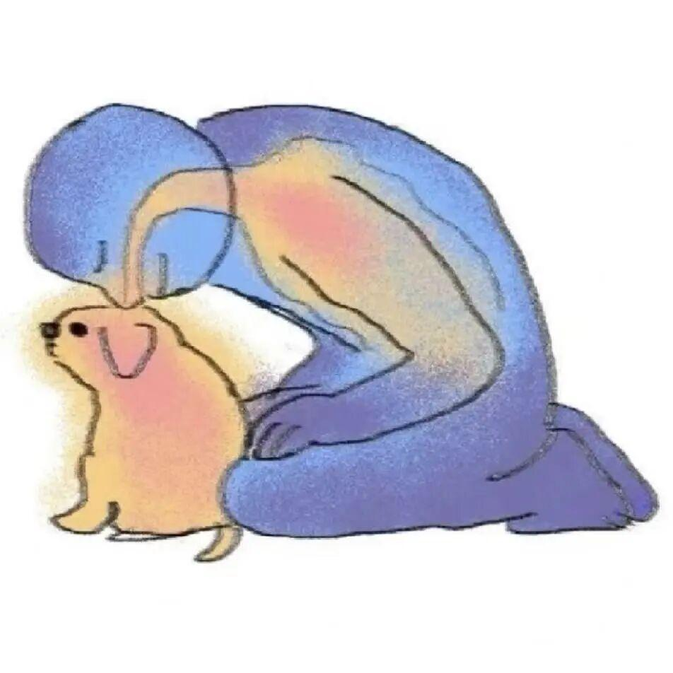

[toc]

# 问题

提问者：**<a href="https://www.zhihu.com/people/he-yi-jie-you-83-38">何以解忧</a>**
提问时间: 2026-8-16 9:57:17
总回答数: 1703
总访问量: 49756228

可以是教育科研，也可以是职场，亦或者是其他

# 回答

回答者： **<a href="https://www.zhihu.com/people/knowyourself-1">KnowYourself</a>**
回答时间: 2026-9-7 14:35:24
点赞总数: 500
评论总数: 41
收藏总数: 757
喜欢总数：52

##  **今天教给大家 8 个看似是怪癖，其实特别养脑子的小习惯——** 

###  **01** 

###  **玩俄罗斯方块** 

我坚持最久的一项爱好，就是玩各种弱智（不是）小游戏。

随时随地，任何场合，都可以来一场酣畅淋漓的抓大鹅、消消乐、拧螺丝、拆毛线……

但你别说，这种看起来纯属浪费时间的小游戏，其实有意想不到的效果。

今年 3 月，一篇发表在《柳叶刀》的研究发现， **玩俄罗斯方块可以大幅减少 PTSD 后的创伤性闪回，改善焦虑、失眠和职业倦怠等问题［1］。** 

那些经历过创伤事件的参与者，需要在游戏中配合「心理旋转」（mental rotation），也就是在心里想象如何旋转、移动俄罗斯方块，寻找契合的缝隙。

这个过程会持续占据视觉空间工作记忆， **让大脑没有多余的资源维持那些令人痛苦、焦虑的侵入性画面。** 

虽然，咱们平时在手机上玩的那种 **「没几局就得看 30 秒广告」** 的小游戏，和研究里用的 **「俄罗斯方块.纯净版」** 不一样，但原理是通的。

下次再打开小游戏时，请理直气壮地说：我这是在高强度占用视觉空间工作记忆，给脑子做保养呢~

###  **02** 

###  **吃酸味糖果** 

大家吃过这种很酸的糖没？

小时候总有同学神秘兮兮地递来一颗，刚放进嘴里就能把人酸得像巴甫洛夫的狗一样狂流口水。

出乎意料的是，心理学家发现， **这种酸味糖果可以缓解焦虑和恐慌发作。** 

因为在恐惧或极度焦虑时，我们大脑的杏仁核会过度反应，激活「战逃僵系统」（Fight-Flight-Freeze）。

这时候，一个很有用的办法就是「接地」（grounding）， **也就是通过视觉、听觉、触觉、嗅觉、味觉等具体的感官体验，把注意力拉回到当下［2］。** 

酸味糖果那种尖锐、强烈的口感，能够中断焦虑循环，让注意力回到此时此刻真实的身体感觉。

而且咀嚼、唾液分泌、吞咽动作， **也能缓解高度紧张的状态，促进身体的平静反应［3］。** 

当然，吃糖不能治愈焦虑，但我们可以将这种快速的应急方式，和长期的认知行为训练结合起来，形成更积极的条件反射~

###  **03** 

###  **用两个鼻孔交替呼吸** 

你有没有想过，为什么人会有两个鼻孔，而不是合并成一个更大的、居中的鼻孔？

研究发现，两个鼻孔其实是各司其职的［4］：

➡️右鼻孔呼吸➡️更能帮助降低压力、减少坐立不安，让人感觉更平静；

⬅️左鼻孔呼吸⬅️能够减少无意识的走神，让注意力没那么容易跑掉。

所以有种呼吸练习， **需要你轮流按住两个鼻孔，强迫它们做一休一，即「交替鼻孔呼吸」（Alternate Nostril Breathing）。** 

找个舒服的位置坐好，把右手（惯用手）举到鼻子前：

-   大拇指负责右鼻孔，无名指负责左鼻孔，食指和中指自然弯曲
-   先按住右鼻孔，用左鼻孔缓慢、完整地呼气
-   之后按住左鼻孔，打开右鼻孔缓慢吸气
-   再用右鼻孔呼气、左鼻孔吸气，如此交替

 **只需要每天进行 5 分钟，就能够调节副交感神经系统，有效降低压力和焦虑［6］［7］。** 

![图片来源：PARI[5]](images/150v2-cea548eb335f949537ae89946d6bc75d.jpg)

###  **04** 

###  **在脑门上贴东西** 

最近，一个很流行的说法是：

在脑门上贴东西，可以安抚前额叶、遮住松果体，缓解注意力不集中等 ADHD 症状。

显然， **普通贴纸并不能穿透头皮直达大脑。** 但秉着科学严谨的态度，我们不妨认真研究一下：

 **给前额一点外部刺激，到底有没有用？** 

2019 年的一项研究让 62 名 ADHD 儿童连续 4 周在每晚睡觉时，都在前额贴上电极，通过非常微弱的电流刺激额头区域的三叉神经［8］。

结果发现， **孩子们的 ADHD 症状确实有所改善，右侧额叶的脑电波也出现了变化。** 

但是！今年一项规模更大、设计也更严格的验证性研究再次测试了这种疗法， **却没有发现显著的治疗效果［9］。** 

 **那么，为什么对有些人来说，在脑门上贴东西，确实能带来还不错的效果？** 

因为这种额头上非常具体、持续的异物感， **可以作为一个小小的注意力锚点，** 提醒自己保持专心。

并且「贴上它＝我要开始专心了」的心理暗示， **多少也能给大脑带来积极的开工信号~** 

###  **05** 

###  **在黑暗中洗澡** 

作为在洗澡时吃橙子/芒果的实践者，最近我的洗澡仪式已经升级，开始摸黑洗澡了。

在昏暗的环境中，感受热水浇在身上，确实有一种很神奇的感觉，让人想起当年甩着纤毛在水里无忧无虑地游来游去的日子……

研究发现，用温热的水包裹住身体，可以让人舒服得像一条刚煮熟的海带， **降低压力和皮质醇水平，提升幸福感［10］。** 

再把灯光调暗一点，少给眼睛一些刺激， **能减少光线对褪黑素分泌的干扰，** 让身体更顺利地进入「睡眠模式」［11］。

一项元分析还研究了最佳洗澡时间和温度［12］，把这几件事叠在一起，就成了一个很有用的睡前小仪式——

忘掉人类世界的纷扰，专心享受你的睡前草履虫时光吧~

###  **06** 

###  **在骑车时大声跟唱 DJ热曲** 

长大后终于理解的事，除了爸妈真的需要在下班到家时，那块肉已经解冻好了——还有听土味DJ。

什么伤感爵士、悲伤民谣，通通抛在脑后，只有 DJ 硬曲合集才能点燃我。

研究发现， **大脑中的神经元会随着电子音乐的节拍同步放电［16］，** 强劲的鼓点和贝斯还会调节与运动相关的脑区，让人更想随着音乐一起摇摆［17］。

而且光听还不够，DJ 热曲真正的爽点在于，完全不顾及音准和听众死活地大声跟唱。研究发现， **唱歌之后，唾液中的皮质醇水平会下降，人也会感觉更加轻松［18］。** 

如果说跟唱 DJ 热曲是 pro 版本，那么一边骑车一边大声跟唱，则是 pro max 版本。

 **把音乐和运动的节奏同步起来，能显著改善运动的心理体验，提高外部注意力，降低主观疲劳感［19］。** 

脚下的自行车是我的征战坐骑，耳机里的音乐是勇者自带的 BGM，风在耳边呼啸，命运在前方召唤。

这一刻我终于理解了外放 DJ 的外卖骑手。

###  **07** 

###  **四肢着地，在地上爬** 

还记得我们在前面说过的「接地」（grounding）吗？

除了吃酸味糖果，用味觉把自己拉回当下，还有一种更直观的接地方法是 ——  **爬** 

有种说法认为，人长期穿着鞋、待在室内，会和地球表面的自然电荷「断联」。 **赤脚接触草地、泥土等地面，可以重新「接地气」，改善压力、睡眠、疼痛和自主神经活动［13］。** 

如果想让这种感官拉满的体验效果翻倍，还可以四肢着地，像小动物一样爬行。

研究发现， **四足运动训练能显著提升大脑对身体关节、空间位置和姿态动作的本体感觉，同时改善认知表现［14］。** 

当然，对现代人来说，光天化日之下在公园草地上满地乱爬，确实会有点心理负担。

我们可以先从低配版开始~

脱掉鞋袜，赤脚踩在家里的地板或瑜伽垫上，有条件的朋友还可以和小猫小狗一起，肆无忌惮地爬上两圈。

###  **08** 

###  **反复看《甄嬛传》《潜伏》** 

###  **《我的前半生》《士兵突击》** 

相信大部分人都做过的「怪癖」，就是反复看老剧。

不信试试看，你能不能说出下半句：

-   臣妾要告发熹贵妃私通——
-   阿姨，您找谁——
-   余则成，大鸡蛋——
-   我是你的俘虏，这些武器——

心理学家发现，在完成需要消耗意志力的任务后， **重温喜欢的老剧可以降低认知负担，恢复专注力和自控力［15］。** 

那些倒背如流的剧情，根本不需要我们动脑猜下一步；剧里的角色，也像一群老朋友一样稳定、知根知底。

 **你知道一切都会按熟悉的方式发生，这种笃定本身，就能带来充分的安全感和掌控感。** 

so 反复看 ky 文章，怎么不算一种养脑呢~

  

  

Reference：

［1］Beckenstrom, A. C., Bonsall, M. B., Markham, A., Slade, O., Ramineni, V., Iyadurai, L., Islam, Z., Highfield, J., Jaki, T., Goodwin, G. M., Dias, R., Daniels, R., Malik, A., Summers, C., Kingslake, J., & Holmes, E. A. (2026). A digital imagery-competing task intervention for stopping intrusive memories in trauma-exposed health-care staff during the COVID-19 pandemic in the UK: a Bayesian adaptive randomised clinical trial. The lancet. Psychiatry, 13(3), 233–247.

［2］Timothy, E. (2024, February 14). Ask an expert — Sour power: Can candy help stave off panic and anxiety attacks? Utah State University Extension. [https://extension.usu.edu/news/can-candy-help-stave-off-panic-and-anxiety-attacks](https://extension.usu.edu/news/can-candy-help-stave-off-panic-and-anxiety-attacks)

［3］Garone, S. (2023, April 25). Does eating sour candy help with anxiety? Health. [https://www.health.com/sour-candy-for-anxiety-7480402](https://www.health.com/sour-candy-for-anxiety-7480402)

［4］Vanutelli, M. E., Grigis, C., & Lucchiari, C. (2024). Breathing Right… or Left! The Effects of Unilateral Nostril Breathing on Psychological and Cognitive Wellbeing: A Pilot Study. Brain sciences, 14(4), 302.

［5］PARI.Alternate nostril breathing – a respiratory therapist and physiotherapist explains the breathing technique.[https://www.pari.com/int/blog/alternate-nostril-breathing-technique/](https://www.pari.com/int/blog/alternate-nostril-breathing-technique/)

［6］Sinha, A. N., Deepak, D., & Gusain, V. S. (2013). Assessment of the effects of pranayama/alternate nostril breathing on the parasympathetic nervous system in young adults. Journal of clinical and diagnostic research: JCDR, 7(5), 821.

［7］Bentley, T. G. K., D'Andrea-Penna, G., Rakic, M., Arce, N., LaFaille, M., Berman, R., Cooley, K., & Sprimont, P. (2023). Breathing Practices for Stress and Anxiety Reduction: Conceptual Framework of Implementation Guidelines Based on a Systematic Review of the Published Literature. Brain sciences, 13(12), 1612.

［8］McGough, J. J., Sturm, A., Cowen, J., Tung, K., Salgari, G. C., Leuchter, A. F., Cook, I. A., Sugar, C. A., & Loo, S. K. (2019). Double-Blind, Sham-Controlled, Pilot Study of Trigeminal Nerve Stimulation for Attention-Deficit/Hyperactivity Disorder. Journal of the American Academy of Child and Adolescent Psychiatry, 58(4), 403–411.e3.

［9］Conti, A. A., Bozhilova, N., Eraydin, I. E., Stringer, D., Johansson, L., Marhenke, R., ... & Rubia, K. (2026). External trigeminal nerve stimulation in youth with ADHD: a randomized, sham-controlled, phase 2b trial. Nature Medicine, 32(2), 582-590.

［10］Rapolienė, L., Rapolis, D., Bredelytė, A., Taletavičienė, G., Fioravanti, A., & Martinkėnas, A. (2025). Balneotherapy as a Complementary Intervention for Stress and Cortisol Reduction: Findings from a Randomized Controlled Trial. Brain sciences, 15(2), 165.

［11］Gooley, J. J., Chamberlain, K., Smith, K. A., Khalsa, S. B., Rajaratnam, S. M., Van Reen, E., Zeitzer, J. M., Czeisler, C. A., & Lockley, S. W. (2011). Exposure to room light before bedtime suppresses melatonin onset and shortens melatonin duration in humans. The Journal of clinical endocrinology and metabolism, 96(3), E463–E472.

［12］Haghayegh, S., Khoshnevis, S., Smolensky, M. H., Diller, K. R., & Castriotta, R. J. (2019). Before-bedtime passive body heating by warm shower or bath to improve sleep: A systematic review and meta-analysis. Sleep medicine reviews, 46, 124–135.

［13］Menigoz, W., Latz, T. T., Ely, R. A., Kamei, C., Melvin, G., & Sinatra, D. (2020). Integrative and lifestyle medicine strategies should include Earthing (grounding): Review of research evidence and clinical observations. Explore (New York, N.Y.), 16(3), 152–160.

［14］Matthews, M. J., Yusuf, M., Doyle, C., & Thompson, C. (2016). Quadrupedal movement training improves markers of cognition and joint repositioning. Human movement science, 47, 70-80.

［15］Derrick, J. L. (2013). Energized by television: Familiar fictional worlds restore self-control. Social Psychological and Personality Science, 4(3), 299-307.

［16］Aparicio-Terrés, R., López-Mochales, S., Díaz-Andreu, M., & Escera, C. (2025). The strength of neural entrainment to electronic music correlates with proxies of altered states of consciousness. Frontiers in Human Neuroscience, 19, 1574836.

［17］Li, C. W., & Tsai, C. G. (2024). The presence of drum and bass modulates responses in the auditory dorsal pathway and mirror-related regions to pop songs. Neuroscience, 562, 24-32.

［18］Sakano, K., Ryo, K., Tamaki, Y., Nakayama, R., Hasaka, A., Takahashi, A., Ebihara, S., Tozuka, K., & Saito, I. (2014). Possible benefits of singing to the mental and physical condition of the elderly. BioPsychoSocial medicine, 8, 11.

［19］Quan, Y., Olsen, K. N., & Thompson, W. F. (2025). The emotional and cognitive effects of synchronizing to music during acute exercise: An fNIRS study. Annals of the new York Academy of Sciences, 1552(1), 284-296.

  

原文地址：[(KnowYourself)可不可以莫名其妙地教我一个知识?](https://www.zhihu.com/question/2072260638768997299/answer/2080303166034387216) 

