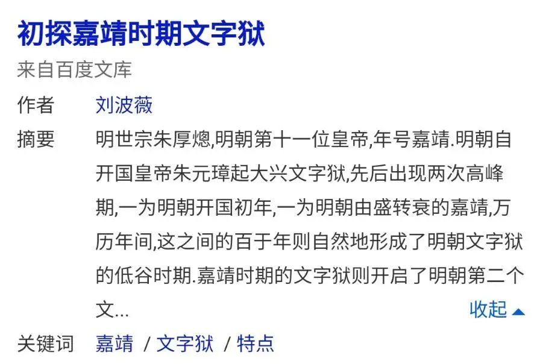

[toc]

# 问题

提问者：**<a href="https://www.zhihu.com/people/he-yi-jie-you-83-38">何以解忧</a>**
提问时间: 2026-8-16 9:57:17
总回答数: 1704
总访问量: 49758378

可以是教育科研，也可以是职场，亦或者是其他

# 回答

回答者： **<a href="https://www.zhihu.com/people/zhan-mei-76-81">上单祢衡</a>**
回答时间: 2026-9-8 9:48:37
点赞总数: 187
评论总数: 54
收藏总数: 66
喜欢总数：10

<mark>我发现东西半球存在一个古代历史规律: 每次西方发生一次大的进步，比如工业革命，东方就会开始一次大规模文字狱。</mark>

1760年，英国瓦特制成的改良型蒸汽机，有力推动了各种机器的普及和发展。随后西方各种生产机器纷纷问世，人类社会由此进入了“蒸汽时代”，史称第一次工业革命。那么这段时间的东方是谁在当政呢？乾隆，他的文字狱被称为中国历代的最顶峰（起码是清朝的顶峰），连街边的疯子说胡话都被抓起来剐了。

1866年德国西门子发明发电机，1879年美国爱迪生发明电灯，人类社会由此进入了“电气时代”，史称第二次工业革命。而彼岸的大清，其绵延百年的文字狱风波本已在嘉庆朝彻底结束。以后道光、咸丰、同治连续三朝皇帝，在长达50年统治期间都几乎没有任何言罪的记载。然而到光绪朝时，文字狱忽然复兴，数以万计的官民和家属被抓入监狱（当然主要是慈禧干的）。那么光绪是哪一年登基的呢？1875年，距离西门子发电机的问世刚过去十年不到。

[为什么清朝可以撑到20世纪才灭亡？](https://www.zhihu.com/question/57453282/answer/44086231491?share_code=16A75018rbuIl&utm_psn=1915817889304404100)

另外我要强调一句: 虽然我不喜欢清朝，但这类事不能总怪满清，搁汉人王朝比如明朝也一样。比如哥伦布发现新大陆是1490年，麦哲伦全球航行完成时的1522年，两次航行乍看似乎没什么，但此后西方就开始大搞海外殖民地，出海频繁。而在1522年的中国，明朝嘉靖帝登基，他之后的统治则被公认是明朝文字狱的高峰，可以比肩明朝初期的洪武永乐。

<mark>换言之，古代的中国统治者没有一般想的那么愚昧，他们其实完全知道东西方的差距问题，不然也不会这么手忙脚乱地去堵嘴。</mark>

  

原文地址：[(上单祢衡)可不可以莫名其妙地教我一个知识?](https://www.zhihu.com/question/2072260638768997299/answer/2080593382095771378) 

