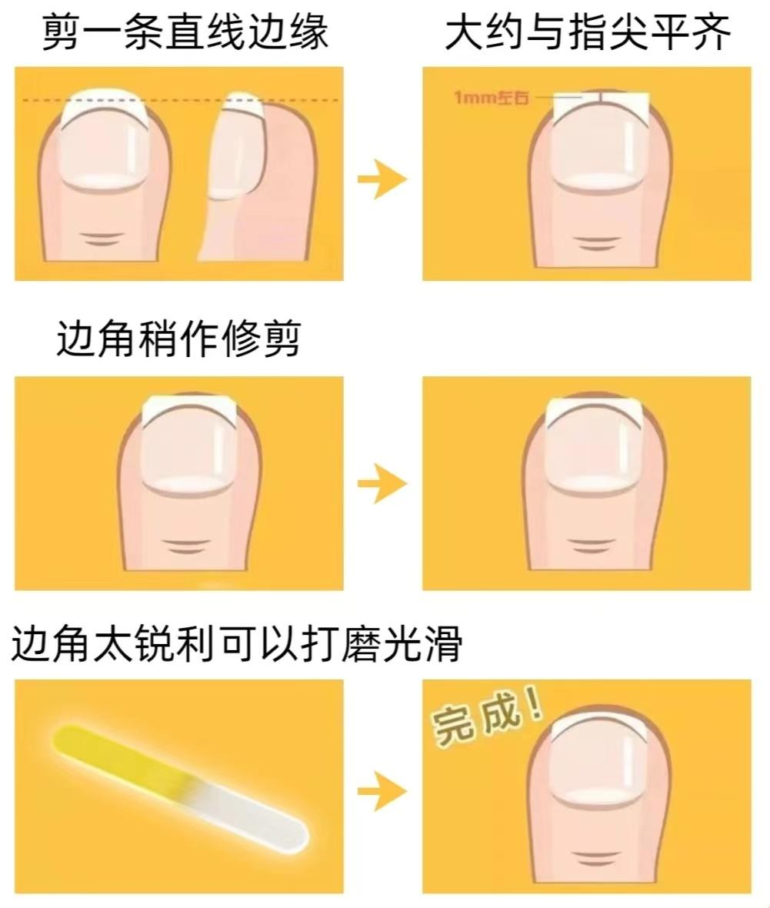
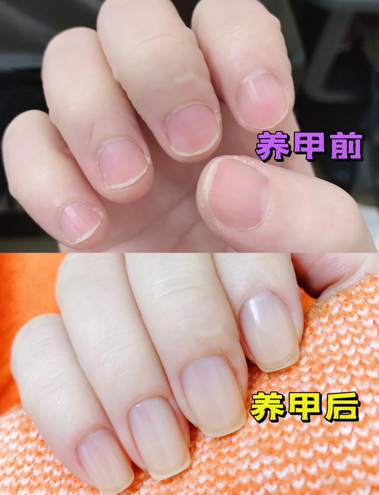

[toc]

# 问题

提问者：**<a href="https://www.zhihu.com/people/he-yi-jie-you-83-38">何以解忧</a>**
提问时间: 2026-8-16 9:57:17
总回答数: 1704
总访问量: 49758378

可以是教育科研，也可以是职场，亦或者是其他

# 回答

回答者： **<a href="https://www.zhihu.com/people/2-46-84-13">大峰</a>**
回答时间: 2026-9-10 11:29:57
点赞总数: 105
评论总数: 48
收藏总数: 160
喜欢总数：8

指甲修剪法。直线一刀下去，刚开始很丑。剪几个月，扇形指甲会渐渐聚拢变得美观。我实践过了，这是近年学到最有用的知识。

好像有同学没看懂，更新一下。这个修剪法是让不好看的扇形指甲逐渐改善，类似下图。达到图中的效果应该不大可能，但会改善，指甲游离线也会恢复一些。

  

原文地址：[(大峰)可不可以莫名其妙地教我一个知识?](https://www.zhihu.com/question/2072260638768997299/answer/2081343659241489170) 

