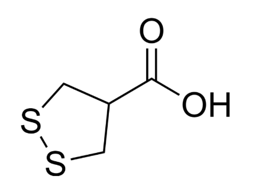

[toc]

# 问题

提问者：**<a href="https://www.zhihu.com/people/he-yi-jie-you-83-38">何以解忧</a>**
提问时间: 2026-8-16 9:57:17
总回答数: 1703
总访问量: 49756228

可以是教育科研，也可以是职场，亦或者是其他

# 回答

回答者： **<a href="https://www.zhihu.com/people/xiao-xuan-zhong-86">想象中</a>**
回答时间: 2026-8-27 23:53:32
点赞总数: 431
评论总数: 57
收藏总数: 324
喜欢总数：13

含硫丰富的蔬菜吃多了，代谢形成的硫化物进入体液，体味会变重，代表比如大蒜、洋葱，芦笋,十字花科蔬菜等。

这里芦笋要特别提一下，它会使尿液的味道变得非常难闻，不同人感受不同，有说像臭鸡蛋、煮过头的卷心菜或烂洋葱的。这和芦笋中特有的芦笋酸有关，它本身没有太大气味，但它分子小，结构特殊，进入人体后经过消化代谢，会迅速分解成多种含硫的小分子化合物，比如甲硫醇、二甲硫醚、二甲亚砜、二甲砜等。

其中一些硫化物挥发性很强，而且气味在极低浓度下就能被闻出来，专业点说就算嗅阈值非常低，一亿甚至十亿分之一的浓度就可以被闻到。总之，吃了芦笋后几小时内，体液的气味、体味就会变。^[生活家化学通识课(原著第6版) (澳)本·赛林格,(澳)拉塞尔·巴罗 著p151]

如果体会不到不同浓度有机硫有多臭的话，臭鼬喷雾剂、煤气里的加臭剂也是小分子的有机硫，有售。

[为什么世界上最臭的物质都和 VI A 族（氧族）元素有关？](https://www.zhihu.com/question/386784461/answer/1895145678)

类似的，硒和碲化合物进入体内后也会代谢成有机硒、有机碲，它们也是易挥发，具典型蒜臭味，且嗅阈值也离谱或者说更离谱。

这导致硒化物和碲化物中毒有一个特点， **短暂吸入或皮肤稍接触后即可引起呼气及汗液中长时间带蒜臭味（也有说硫磺甜味或金属味的，还有直接说“碲味”的）。** 

就是说手摸一摸含碲的物质，比如单质或有机碲，可能让你几天甚至几周内呼气及汗液中长时间带蒜臭味。

碲的化合物在体内基本都会先还原为碲单质（所以毒性比硒小），大部分碲化物会在吸收后几天内内排出，剩下少量的碲化合物在体内首先还原为碲单质沉积，其中一部分不断地转变为二甲基碲及二乙基碲，经尿、粪及呼气排出，气味就这么来的。

至于为什么能持续很长时间，一种观点认为碲会和巯基的作用，从而对酶系统产生抑制，使得碲排泄缓慢。

硒在这方面研究更多，硒的药理以及和GSH的爱恨情仇，硒相关保健品软文里能找到不少，就不展开了。

感觉碲中毒这知识挺适合配伊藤润二风的小故事。

遇过一位返聘回来带有机实验的老教授，他退休前就研究含硫族元素的有机化合物，据说他们组当年做实验的时候会和整个一层的人说好，让他们离开，想想还挺有排面的。

  

原文地址：[(想象中)可不可以莫名其妙地教我一个知识?](https://www.zhihu.com/question/2072260638768997299/answer/2076457356213352268) 

