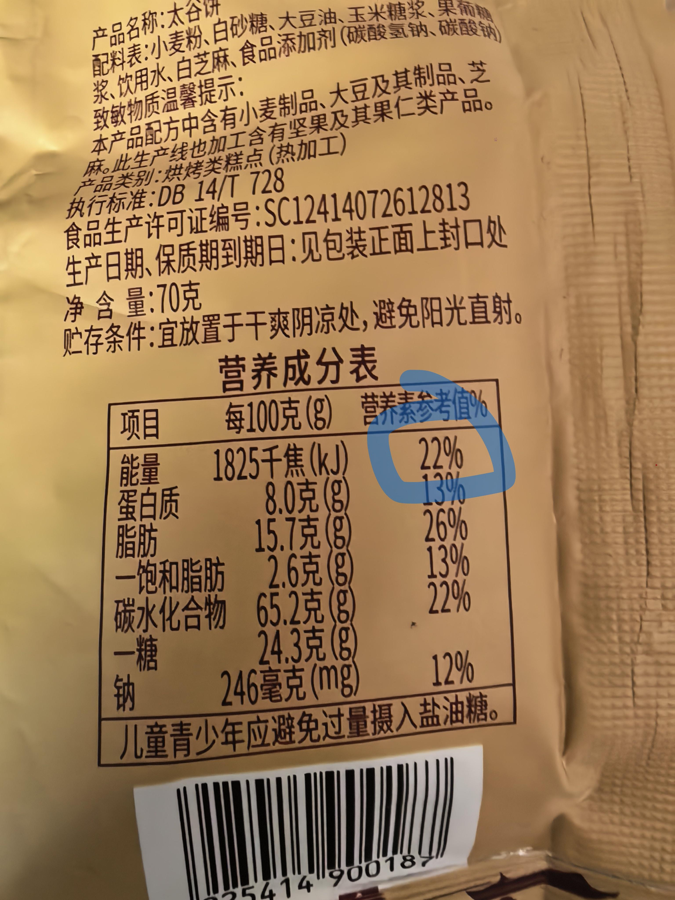
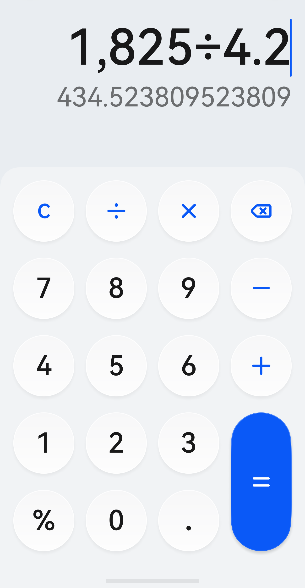
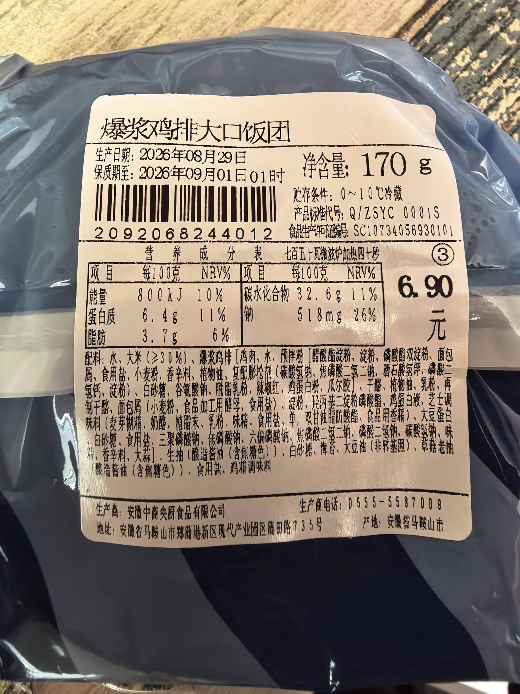

[toc]

# 问题

提问者：**<a href="https://www.zhihu.com/people/he-yi-jie-you-83-38">何以解忧</a>**
提问时间: 2026-8-16 9:57:17
总回答数: 1703
总访问量: 49754474

可以是教育科研，也可以是职场，亦或者是其他

# 回答

回答者： **<a href="https://www.zhihu.com/people/ni-zhi-dao-wo-bu-zhi-dao-42-87">戶萌與章</a>**
回答时间: 2026-8-30 14:2:44
点赞总数: 5627
评论总数: 239
收藏总数: 4191
喜欢总数：304

如何快速计算包装食品的热量。

 **省流版：** 只需要将下图 **圈中的数字乘以二十，再带上单位大卡（kcal）** 。以这个饼为例，每百克的热量就是 **22×20＝440大卡。** 

下面是 **原理** ：

在食品营养成分表里，热量一栏通常会用千焦（kJ）这个单位表示。这一数字往往成百上千，且经常有零有整。但在日常记录饮食和称说热量时，为了计算的方便，我们一般会采用千卡（kcal）这一单位，也就是俗称的大卡。千卡（kcal）和千焦（kJ）的换算关系如下：

 **1 千卡（kcal，大卡） = 4.184 千焦（kJ）** 

所以在对照营养成分表计算热量时，我们可以 **用千焦（kJ）数除以4.2得到近似的大卡（kcal）数。** 例如上文提到的太谷饼的每百克热量就约为435大卡：

这样除以4.2的办法确实方便一些，但毕竟涉及到了四位数的乘除法。对于小学生来说或许得心应手，但对于大学生甚至年纪更大的朋友，这样的计算量可能还是有点难为人了。

因此我们要借用到另一个指标： **营养素参考值％（NRV％）** 

 **简单来说，就是每100克（或每份）食物里的营养素，占你全天推荐摄入量的百分比。** 

例如太谷饼在热量栏的NRV％是22％，也就意味着 **每百克太谷饼的热量，占据了你全天推荐摄入热量的22％。** 

而恰好， **中国NRV标准基于每天2000千卡能量需求设定** （参考GB 28050标准。核心固定值包括：能量8400千焦、蛋白质60g、脂肪60g、碳水化合物300g、钠2000mg、膳食纤维25g等）

因此， **只需要将NRV的百分比值乘以二十，就可以直接得到以大卡（kcal）为单位的食物热量值。** 

太谷饼的热量就是每百克：22×20＝440大卡

以此类推，下面这个罗森饭团的热量就约为每百克：10×20=200大卡（kcal）。

  

原文地址：[(戶萌與章)可不可以莫名其妙地教我一个知识?](https://www.zhihu.com/question/2072260638768997299/answer/2077395842294718780) 

