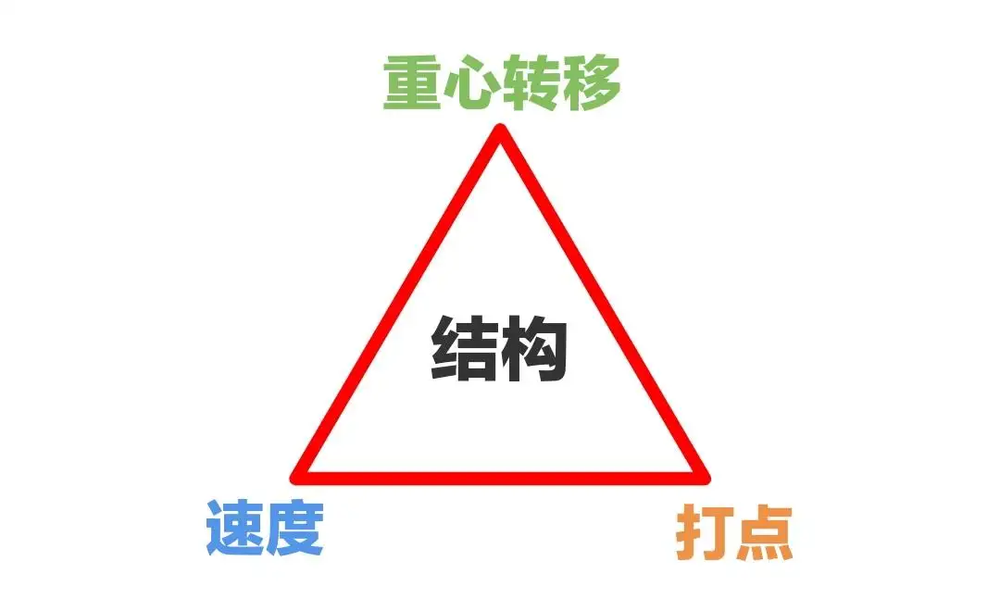
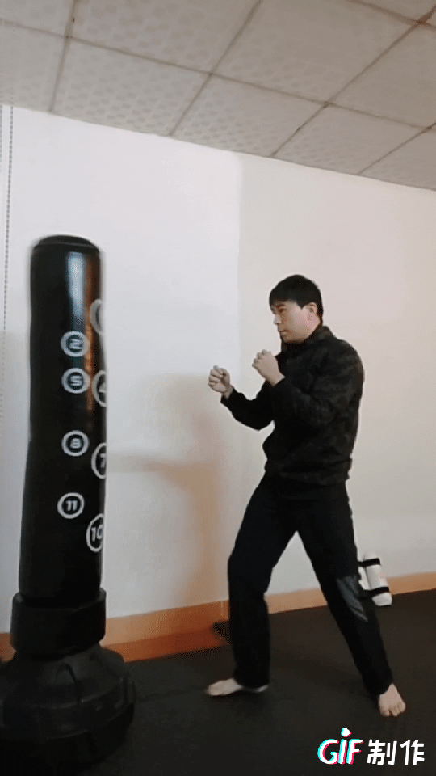

[toc]

# 问题

提问者：**<a href="https://www.zhihu.com/people/he-yi-jie-you-83-38">何以解忧</a>**
提问时间: 2026-8-16 9:57:17
总回答数: 1704
总访问量: 49757567

可以是教育科研，也可以是职场，亦或者是其他

# 回答

回答者： **<a href="https://www.zhihu.com/people/quan-lang-mai-si-21">武者麥斯</a>**
回答时间: 2026-8-27 20:24:42
点赞总数: 123
评论总数: 12
收藏总数: 186
喜欢总数：5

绝大多数人教武术和格斗，都会跟你强调两件事：

一个是怎么发力，一个是怎么增强力气。

然后就开始扯本门劲力有多么神，要怎么把内劲养出来，不理解的还以为是说泰国那些养鬼仔。

不然就是跟你说人体结构，解剖图，科学原理，然后做一大堆力训。好像不是魔鬼筋肉人或科学怪人就打不出厉害的拳脚来。

实际上，只要你明白了原理，加上足够的训练量，也有一定的身体素质做后盾，拳脚就可以充满威力。

[怎么打出重拳？](https://zhuanlan.zhihu.com/p/415407406?share_code=vm39bw2dZBGY&utm_psn=2076348208616306506)

比如在上面的文章里，<mark>我提出了「重拳三要素」： **速度、打点、重心转移** 。</mark>

这三点做到位了，哪怕你出拳动作不够完美，还是会有不错的效果。

当然了，想更加完美的，便需要加上最后一个核心要素，就是 **结构** 。

对啊，讲怎么打出重拳，但全程不提力量。

一来是因为，太重视肌肉力量，很容易走歪，想依赖蛮力。

人性就是这样，找到捷径不可能不走啊！但结果就是，只靠肌肉（尤其是大围度）打出来的蛮力，对自身体力消耗也特别高，而且通常控制度比较低，万一打空了，破绽也更加明显。

肌肉力量虽然重要，可惜不少人，包括职业格斗运动相关人员，在肌力对输出效果影响这事上的认知有偏差，而且长期没有得到纠正～千万别以为「专业的就什么都对」。

二来则是，结构本来就是一种力量来源，即所谓结构力。

比如我前几天在知乎看到一个外国视频，一帮学生展示他们用木条制作的建筑模型，重点是需要在上面放哑铃砖头等重物测试稳固程度。绝大多数模型都倒塌了，最后一个最坚固的，评论区很多知友都说「这不就是小蛮腰么？」

也就是看完视频，大家才惊觉原来广州塔这个外形不仅是为了美观，还有实际作用。

接着再用最简单的人话说明怎么打出重拳。

1.  出拳快～但是这种快不是绷紧的，而是尽可能地放松，以避免因紧张而减慢了速度
2.  打点深～拳头不要在表面停留，必须想象它是子弹那样「穿透」目标
3.  压体重～手臂重量小，威力有限，加上体重在手臂背后，带着撞过去的感觉，就可以产生巨大动能

因此要打出所谓的重拳，不是研究如何「更加用力」，而是怎么提高效率。毕竟谁都不会这么笨花大力做小事。反而能花小力做大事才合理。

好了，我已经把重点都教会你了，去打张志磊吧！加油！（逃）

  

原文地址：[(武者麥斯)可不可以莫名其妙地教我一个知识?](https://www.zhihu.com/question/2072260638768997299/answer/2076404801898803698) 

