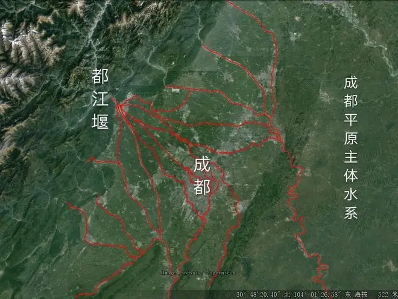
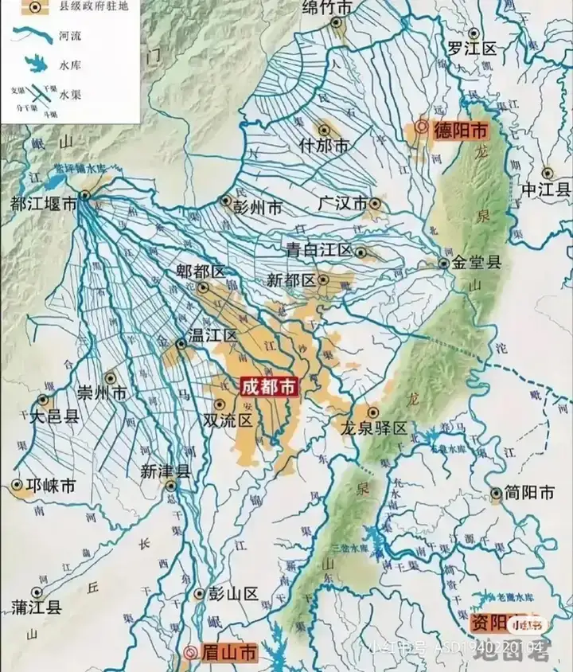

[toc]

# 问题

提问者：**<a href="https://www.zhihu.com/people/he-yi-jie-you-83-38">何以解忧</a>**
提问时间: 2026-8-16 9:57:17
总回答数: 1703
总访问量: 49756228

可以是教育科研，也可以是职场，亦或者是其他

# 回答

回答者： **<a href="https://www.zhihu.com/people/luo-ming-68-44">金牛座的怪蜀黍</a>**
回答时间: 2026-9-4 11:8:50
点赞总数: 587
评论总数: 161
收藏总数: 174
喜欢总数：16

给你一个地理知识点。

如果你来到了成都，你所能见到的每一条河，几乎都是来自都江堰一气化三清，哦不，一瓶分二水，二水分四河，四河生万物而成的

如果不信，你可以找个无聊的时候，打开百度地图，然后搜成都市区内的河流

府河、沙河、南河、清水河、肖家河、江安河、毗河、沱江河、东风渠、摸底河、小沙河

你把这些河一条一条的顺藤摸瓜向上溯源，你会发现最后都汇集到了都江堰

然后这些河产生的各种湖诸如浣花溪、东湖、北湖、南湖、锦城湖、黑龙滩、菁蓉湖、升仙湖

总之，就这么说吧成都本没有河，都是因为都江堰，就有了一大堆河，还有湖。

所以都江堰并不只是一个分水口那么简单，而实际上，都江堰是一个超级巨大的平原灌溉体系，就靠着都江堰分出的这些岷江水，在成都平原上阡陌连巷，沟渠纵横，组成了一张密密麻麻无处不在的灌溉网，滋润着成都平原的千里沃土

这在农业时代，是非常伟大的创举，所以秦国得了蜀，相当于增加了一个超级粮仓，最后能跟六国一直消耗，得了天下

回头再来看看关中平原，即便现在看卫星地图，也能看出平原面积也远超成都平原，古代本来天府之国的美名是说关中平原的，可后来就因为没水了，就渐渐衰落了。

而成都却靠着李冰修建的都江堰，将天府之国的名声接了过来，并延续千年至今

所以为啥余秋雨说问道青城山，拜水都江堰了。你如果了解到这个冷知识，是不是也想拜一拜都江堰了呢？

还有一个知识点，不知道算不算冷，那就是能压制齐天大圣孙悟空的二郎显圣真君，其实也算是都江堰人啦。毕竟二郎神的道场在灌口，这个灌口就是都江堰古称，灌县。追溯起源的话，那就是李冰父子治水而被当地民众崇拜而衍化的泛水神信仰

其文字记载最早见于唐代，唐崔令钦《[​教坊记](https://baike.baidu.com/item/%E6%95%99%E5%9D%8A%E8%AE%B0/843472?fromModule=lemma_inlink)》收有《二郎神》词牌，乃唐初宫廷音乐家根据民间娱神咏唱二郎神的曲调制成，说明唐初已经出现名为二郎神的神祇。《安义县志》载唐[​永徽](https://baike.baidu.com/item/%E6%B0%B8%E5%BE%BD/7645232?fromModule=lemma_inlink)年间有圣水庙，祀二郎神。

当然在都江堰也是有李冰父子的庙的，就是二王庙，祭祀李冰和二郎神的庙宇。唐末五代，二郎神信仰逐渐盖过李冰，使其成为二郎神祖庙。清乾隆时之《灌县志》中称“二郎庙”，后遂称之曰“二王庙”。

  

原文地址：[(金牛座的怪蜀黍)可不可以莫名其妙地教我一个知识?](https://www.zhihu.com/question/2072260638768997299/answer/2079164016539219179) 

